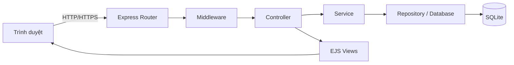
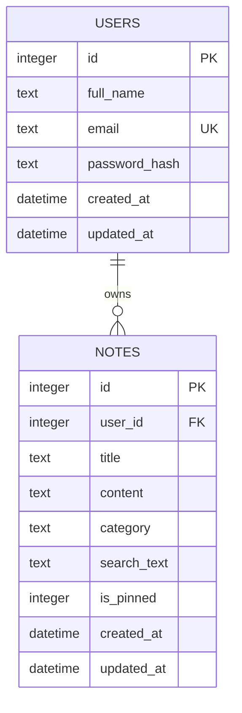
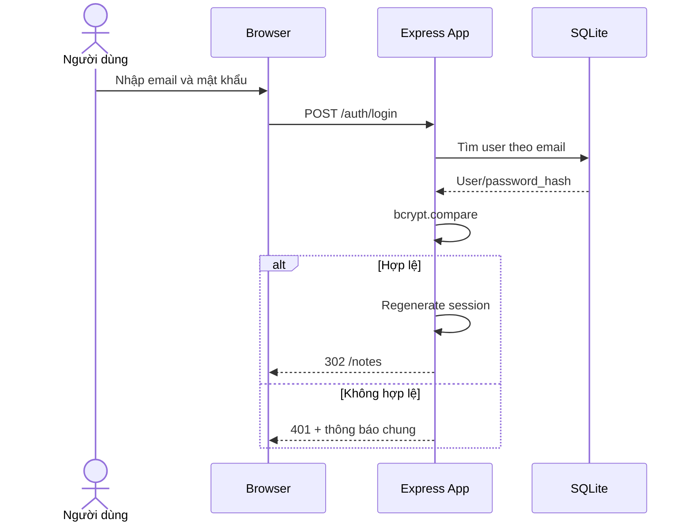
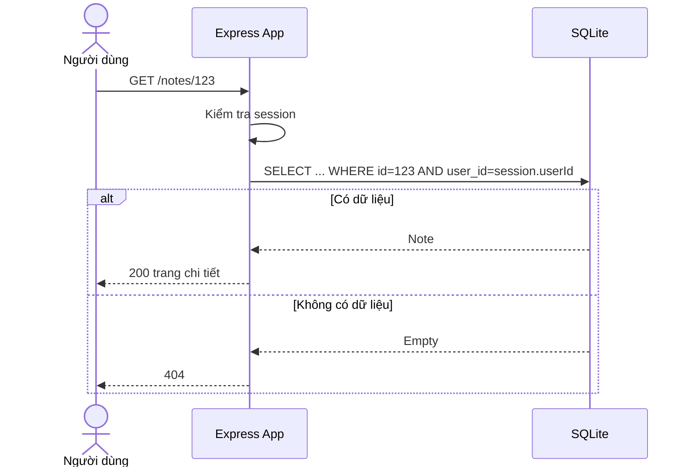

# ĐẶC TẢ KỸ THUẬT CHI TIẾT
## Ứng dụng quản lý ghi chú cá nhân (Personal Note App)

**Phiên bản:** 1.1  
**Môn học:** IT4409 – Công nghệ Web và dịch vụ trực tuyến  
**Mục tiêu:** Xây dựng ứng dụng web cho phép người dùng đăng ký, đăng nhập và quản lý ghi chú cá nhân, đáp ứng đầy đủ CRUD, phân quyền dữ liệu, lọc dữ liệu, responsive, validation và xử lý lỗi HTTP.

---

# 1. Tổng quan sản phẩm

## 1.1. Bối cảnh

Ứng dụng được xây dựng cho bài thi cuối kỳ. Phạm vi cần đủ rõ ràng để hoàn thiện trong thời gian ngắn nhưng vẫn bao phủ toàn bộ yêu cầu:

- CRUD dữ liệu chính.
- Dữ liệu riêng theo từng tài khoản.
- Có trường phân loại/lọc.
- Giao diện responsive.
- Kiểm tra dữ liệu đầu vào.
- Xử lý lỗi tập trung và sử dụng HTTP status phù hợp.
- Có mã nguồn công khai, bản demo đã triển khai và tài khoản demo.

## 1.1.1. Định hướng giao diện

Giao diện của ứng dụng phải được thiết kế theo hướng **đơn giản, dễ sử dụng và dễ hoàn thiện**, không ưu tiên hiệu ứng phức tạp hoặc trang trí cầu kỳ. Mục tiêu chính là giúp người dùng thực hiện nhanh các thao tác bắt buộc trong đề bài.

Giao diện tối thiểu phải bảo đảm:

- Có đầy đủ màn hình tạo, xem danh sách, xem chi tiết, sửa và xóa ghi chú.
- Có khu vực tìm kiếm, lọc theo danh mục và sắp xếp dữ liệu.
- Hiển thị tốt trên cả desktop và mobile.
- Form có nhãn rõ ràng, thông báo lỗi dễ hiểu và nút thao tác dễ nhận biết.
- Có trạng thái danh sách rỗng, không có kết quả, lỗi 404 và lỗi hệ thống.
- Không sử dụng các thành phần UI không cần thiết như animation phức tạp, dashboard nhiều biểu đồ, rich text editor hoặc layout nhiều tầng.

Tiêu chí ưu tiên là **đáp ứng đúng và đủ yêu cầu của đề thi**, thay vì xây dựng một giao diện nhiều tính năng nhưng khó hoàn thiện hoặc khó kiểm thử.

## 1.2. Mục tiêu nghiệp vụ

Người dùng có thể:

1. Tạo tài khoản.
2. Đăng nhập và đăng xuất.
3. Tạo ghi chú.
4. Xem danh sách ghi chú của chính mình.
5. Xem chi tiết ghi chú.
6. Chỉnh sửa ghi chú.
7. Xóa ghi chú.
8. Tìm kiếm theo tiêu đề hoặc nội dung.
9. Lọc theo danh mục.
10. Sắp xếp theo thời gian cập nhật.
11. Không thể xem hoặc chỉnh sửa dữ liệu của người dùng khác.

## 1.3. Ngoài phạm vi

Các chức năng sau không bắt buộc trong phiên bản nộp bài:

- Chia sẻ ghi chú giữa nhiều tài khoản.
- Đồng bộ thời gian thực.
- Upload file hoặc hình ảnh.
- Rich text editor phức tạp.
- OAuth Google/Facebook.
- Nhắc lịch và gửi email.
- Offline-first/PWA.
- Phân quyền quản trị viên.

---

# 2. Công nghệ và kiến trúc

## 2.1. Stack đề xuất

| Thành phần | Công nghệ |
|---|---|
| Runtime | Node.js 20 LTS trở lên |
| Web framework | Express.js |
| Template engine | EJS |
| Database | SQLite3 |
| ORM/query | better-sqlite3 hoặc sqlite3 |
| Session | express-session |
| Lưu session khi deploy | Store tự viết trên better-sqlite3 (mục 16.8) |
| Hash mật khẩu | bcrypt |
| Validation | express-validator |
| CSRF | Token tự sinh lưu trong session, không dùng thư viện |
| UI | Bootstrap 5 **self-host** trong `public/vendor/`, không dùng CDN |
| Logging | morgan |
| Security headers | helmet |
| Environment | dotenv |
| Deploy | Render/Railway/Fly.io hoặc nền tảng tương đương |

## 2.2. Kiến trúc logic



## 2.3. Nguyên tắc thiết kế

- Mỗi request đi qua middleware session và authentication.
- Controller không viết SQL trực tiếp.
- Repository chịu trách nhiệm truy vấn cơ sở dữ liệu.
- Mọi truy vấn ghi chú phải gắn với `user_id`.
- Dữ liệu nhập được kiểm tra ở server; validation phía client chỉ hỗ trợ trải nghiệm.
- Không tin dữ liệu từ URL, form, cookie hoặc trình duyệt.
- Xóa dữ liệu sử dụng POST hoặc DELETE, không dùng GET.
- Mọi form thay đổi dữ liệu đều mang CSRF token.

---

# 3. Vai trò và quyền hạn

## 3.1. Khách chưa đăng nhập

Được phép:

- Mở trang chủ.
- Mở trang đăng ký.
- Mở trang đăng nhập.
- Gửi form đăng ký.
- Gửi form đăng nhập.

Không được phép:

- Xem danh sách ghi chú.
- Tạo, sửa hoặc xóa ghi chú.

## 3.2. Người dùng đã đăng nhập

Được phép:

- Xem và quản lý ghi chú của chính mình.
- Cập nhật thông tin hiển thị cơ bản nếu triển khai phần mở rộng.
- Đăng xuất.

Không được phép:

- Truy cập ghi chú của người dùng khác.
- Thay đổi `user_id` của ghi chú.
- Gọi route quản lý khi session không hợp lệ.

---

# 4. Yêu cầu chức năng

## FR-01: Đăng ký tài khoản

### Dữ liệu đầu vào

- Họ tên.
- Email.
- Mật khẩu.
- Xác nhận mật khẩu.

### Quy tắc

- Họ tên: bắt buộc, từ 2 đến 100 ký tự.
- Email: bắt buộc, đúng định dạng, chuyển về chữ thường, không trùng.
- Mật khẩu: tối thiểu 8 ký tự.
- Xác nhận mật khẩu phải khớp.
- Mật khẩu phải được hash trước khi lưu.
- Không trả lại mật khẩu hoặc password hash cho client.

### Kết quả

- Thành công: tạo tài khoản, chuyển tới trang đăng nhập và hiển thị thông báo.
- Email trùng: render lại form đăng ký với mã `409 Conflict` và thông báo “Email đã được sử dụng”.
- Dữ liệu không hợp lệ: render lại form với mã `422 Unprocessable Entity`.

## FR-02: Đăng nhập

- Nhập email và mật khẩu.
- Nếu đúng, tạo session chứa tối thiểu `userId`, `email`, `displayName`.
- Regenerate session sau khi đăng nhập để giảm nguy cơ session fixation.
- Nếu sai, hiển thị thông báo chung: “Email hoặc mật khẩu không chính xác”.
- Không tiết lộ email có tồn tại hay không.

## FR-03: Đăng xuất

- Hủy session server-side.
- Xóa cookie session.
- Chuyển về trang đăng nhập.

## FR-04: Tạo ghi chú

### Trường dữ liệu

- `title`: tiêu đề.
- `content`: nội dung.
- `category`: danh mục.
- `is_pinned`: đánh dấu ưu tiên, tùy chọn.

### Quy tắc

- Tiêu đề bắt buộc, từ 1 đến 150 ký tự.
- Nội dung bắt buộc, tối đa 10.000 ký tự.
- Danh mục bắt buộc và phải thuộc tập cho phép.
- `user_id` lấy từ session, tuyệt đối không lấy từ form.
- `search_text` do service tự sinh từ `title` + `content` (xem mục 6.6), không nhận từ form.
- Sau khi tạo thành công, chuyển đến trang chi tiết hoặc danh sách.

## FR-05: Xem danh sách ghi chú

Danh sách chỉ hiển thị ghi chú của người dùng hiện tại.

Hỗ trợ query:

- `q`: từ khóa tìm kiếm.
- `category`: lọc danh mục.
- `sort`: `updated_desc`, `updated_asc`, `created_desc`, `title_asc`.
- `page`: số trang.

Quy tắc sắp xếp (một quy tắc duy nhất, áp dụng cho mọi trường hợp):

- **Ghi chú được ghim luôn đứng trước**, ở mọi kiểu sắp xếp.
- Sau đó sắp xếp theo giá trị `sort`, mặc định là `updated_desc`.
- Mỗi trang 10 ghi chú.
- Bảng ánh xạ `sort` sang câu SQL xem mục 14.5.

## FR-06: Xem chi tiết ghi chú

- URL chứa ID ghi chú.
- Hệ thống truy vấn bằng cả `id` và `user_id`.
- Không tìm thấy hoặc không thuộc quyền sở hữu: trả `404 Not Found`.
- Không trả `403` để tránh tiết lộ sự tồn tại của dữ liệu người khác.

## FR-07: Chỉnh sửa ghi chú

- Chỉ chủ sở hữu được chỉnh sửa.
- Validation giống chức năng tạo.
- Cập nhật `updated_at`.
- Có thể giữ giá trị form khi validation thất bại.

## FR-08: Xóa ghi chú

- Hiển thị hộp thoại xác nhận.
- Route xóa phải yêu cầu đăng nhập.
- Truy vấn xóa phải có `WHERE id = ? AND user_id = ?`.
- Nếu không có bản ghi bị xóa: trả `404`.
- Sau khi xóa: chuyển về danh sách và hiển thị flash message.

## FR-09: Tìm kiếm và lọc

- Tìm trong `title` và `content`.
- Tìm kiếm không phân biệt hoa thường **và không phân biệt dấu tiếng Việt**: gõ `hoc` vẫn tìm được `Học`.
- Cơ chế: mỗi ghi chú lưu thêm cột `search_text` đã chuẩn hóa; từ khóa nhập vào cũng được chuẩn hóa cùng cách rồi so bằng `LIKE`. Chi tiết ở mục 6.6.
- Lọc theo `category`.
- Cho phép kết hợp tìm kiếm, lọc và sắp xếp.
- Giá trị query phải được whitelist và parameterized.

## FR-10: Thông báo giao diện

Các thao tác thành công hoặc thất bại hiển thị thông báo:

- Tạo ghi chú thành công.
- Cập nhật ghi chú thành công.
- Xóa ghi chú thành công.
- Đăng nhập thất bại.
- Session hết hạn.
- Dữ liệu không hợp lệ.

---

# 5. Yêu cầu phi chức năng

## NFR-01: Responsive

- Hoạt động tốt ở mobile từ 360 px.
- Tablet từ 768 px.
- Desktop từ 1024 px.
- Navbar thu gọn trên mobile.
- Danh sách ghi chú chuyển từ grid nhiều cột sang một cột.
- Form không tràn chiều ngang.
- Nút thao tác có vùng chạm tối thiểu khoảng 40 px.

## NFR-02: Hiệu năng

- Trang danh sách với 1000 ghi chú vẫn phản hồi hợp lý.
- Sử dụng index cho `user_id`, `category`, `updated_at`.
- Phân trang, không tải toàn bộ dữ liệu.
- Không truy vấn lặp không cần thiết.

## NFR-03: Bảo mật

- Hash mật khẩu bằng bcrypt.
- Cookie: `httpOnly`, `sameSite=lax`, `secure=true` trong production.
- Dùng Helmet.
- Escape nội dung khi render bằng EJS `<%= ... %>`.
- Không render nội dung người dùng bằng `<%- ... %>`.
- SQL parameterized.
- Thay session ID sau đăng nhập.
- Giới hạn kích thước body.
- Không lưu secret trong Git.
- Có CSRF token là khuyến nghị mạnh; nếu không triển khai phải dùng SameSite và chỉ thay đổi dữ liệu qua POST.

## NFR-04: Khả dụng

- Có trang 404.
- Có trang 500 thân thiện.
- Form hiển thị lỗi ngay dưới trường.
- Giữ lại dữ liệu hợp lệ khi submit sai.
- Các nút có text rõ ràng, không chỉ dùng icon.

## NFR-05: Khả năng bảo trì

- Tách route, controller, service/repository, middleware và view.
- Đặt tên thống nhất.
- Có `.env.example`.
- Có migration hoặc script khởi tạo DB.
- Có test cho các luồng quan trọng.

---

# 6. Mô hình dữ liệu

## 6.1. ERD



## 6.2. Bảng `users`

| Cột | Kiểu | Ràng buộc | Mô tả |
|---|---|---|---|
| id | INTEGER | PK, AUTOINCREMENT | ID người dùng |
| full_name | TEXT | NOT NULL | Họ tên |
| email | TEXT | NOT NULL, UNIQUE | Email chuẩn hóa chữ thường |
| password_hash | TEXT | NOT NULL | Mật khẩu đã hash |
| created_at | DATETIME | NOT NULL | Thời điểm tạo |
| updated_at | DATETIME | NOT NULL | Thời điểm cập nhật |

## 6.3. Bảng `notes`

| Cột | Kiểu | Ràng buộc | Mô tả |
|---|---|---|---|
| id | INTEGER | PK, AUTOINCREMENT | ID ghi chú |
| user_id | INTEGER | NOT NULL, FK | Chủ sở hữu |
| title | TEXT | NOT NULL | Tiêu đề |
| content | TEXT | NOT NULL | Nội dung |
| category | TEXT | NOT NULL | Danh mục |
| search_text | TEXT | NOT NULL | `title + content` đã bỏ dấu và viết thường, chỉ dùng để tìm kiếm |
| is_pinned | INTEGER | NOT NULL, DEFAULT 0 | 0 hoặc 1 |
| created_at | DATETIME | NOT NULL | Thời điểm tạo |
| updated_at | DATETIME | NOT NULL | Thời điểm cập nhật |

## 6.4. SQL khởi tạo

```sql
PRAGMA foreign_keys = ON;

CREATE TABLE IF NOT EXISTS users (
    id INTEGER PRIMARY KEY AUTOINCREMENT,
    full_name TEXT NOT NULL CHECK(length(full_name) BETWEEN 2 AND 100),
    email TEXT NOT NULL UNIQUE,
    password_hash TEXT NOT NULL,
    created_at DATETIME NOT NULL DEFAULT CURRENT_TIMESTAMP,
    updated_at DATETIME NOT NULL DEFAULT CURRENT_TIMESTAMP
);

CREATE TABLE IF NOT EXISTS notes (
    id INTEGER PRIMARY KEY AUTOINCREMENT,
    user_id INTEGER NOT NULL,
    title TEXT NOT NULL CHECK(length(title) BETWEEN 1 AND 150),
    content TEXT NOT NULL CHECK(length(content) <= 10000),
    category TEXT NOT NULL CHECK(category IN (
        'personal', 'study', 'work', 'idea', 'other'
    )),
    search_text TEXT NOT NULL,
    is_pinned INTEGER NOT NULL DEFAULT 0 CHECK(is_pinned IN (0, 1)),
    created_at DATETIME NOT NULL DEFAULT CURRENT_TIMESTAMP,
    updated_at DATETIME NOT NULL DEFAULT CURRENT_TIMESTAMP,
    FOREIGN KEY (user_id) REFERENCES users(id) ON DELETE CASCADE
);

CREATE INDEX IF NOT EXISTS idx_notes_user_updated
ON notes(user_id, updated_at DESC);

CREATE INDEX IF NOT EXISTS idx_notes_user_category
ON notes(user_id, category);

-- Bảng lưu session, dùng bởi store tự viết ở mục 16.8.
CREATE TABLE IF NOT EXISTS sessions (
    sid TEXT PRIMARY KEY,
    data TEXT NOT NULL,
    expires_at INTEGER NOT NULL
);
```

## 6.5. Danh mục cho phép

| Giá trị lưu | Nhãn hiển thị |
|---|---|
| personal | Cá nhân |
| study | Học tập |
| work | Công việc |
| idea | Ý tưởng |
| other | Khác |

## 6.6. Chuẩn hóa từ khóa tìm kiếm

SQLite mặc định chỉ xử lý hoa/thường cho ký tự ASCII. Hàm `LOWER()` của SQLite **không** đổi được `Ọ` thành `ọ`, nên nếu tìm trực tiếp trên `title`/`content` thì gõ `học` sẽ không ra ghi chú viết `Học`.

Giải pháp: chuẩn hóa bằng JavaScript và lưu sẵn vào cột `search_text`.

```js
// src/utils/normalize.js
function normalize(text) {
  return String(text)
    .toLowerCase()
    .normalize("NFD")                  // tách chữ và dấu
    .replace(/[\u0300-\u036f]/g, "")   // bỏ dấu
    .replace(/đ/g, "d");
}

// "Học Web" -> "hoc web"
```

Quy tắc áp dụng:

- Khi tạo hoặc sửa ghi chú: `search_text = normalize(title + " " + content)`.
- Khi tìm kiếm: `normalize(q)` rồi so bằng `search_text LIKE '%' || ? || '%'`.
- `search_text` chỉ phục vụ tìm kiếm, không bao giờ hiển thị ra giao diện.

Lợi ích phụ: người dùng gõ không dấu vẫn tìm được ghi chú có dấu.

---

# 7. Đặc tả route và HTTP

## 7.1. Route công khai

| Method | Path | Chức năng | Thành công | Lỗi chính |
|---|---|---|---|---|
| GET | `/` | Trang giới thiệu | 200 | 500 |
| GET | `/auth/register` | Form đăng ký | 200 | 500 |
| POST | `/auth/register` | Tạo tài khoản | 302 | 409, 422 |
| GET | `/auth/login` | Form đăng nhập | 200 | 500 |
| POST | `/auth/login` | Xác thực | 302 | 401, 422 |
| POST | `/auth/logout` | Đăng xuất | 302 | 500 |

## 7.2. Route yêu cầu đăng nhập

| Method | Path | Chức năng | Thành công | Lỗi chính |
|---|---|---|---|---|
| GET | `/notes` | Danh sách/tìm kiếm/lọc | 200 | 500 |
| GET | `/notes/new` | Form tạo | 200 | – |
| POST | `/notes` | Tạo ghi chú | 302 | 422 |
| GET | `/notes/:id` | Chi tiết | 200 | 404 |
| GET | `/notes/:id/edit` | Form sửa | 200 | 404 |
| POST | `/notes/:id` | Cập nhật | 302 | 404, 422 |
| POST | `/notes/:id/delete` | Xóa | 302 | 404 |

**Khi chưa đăng nhập:** tất cả route trong bảng này trả `302` chuyển hướng về `/auth/login` kèm flash message, **không** trả `401`. Lý do: đây là ứng dụng render HTML phía server, người dùng cần thấy trang đăng nhập chứ không phải một trang lỗi. Mã `401` chỉ dùng cho `POST /auth/login` khi sai thông tin đăng nhập.

## 7.3. Quy ước status code

| Mã | Trường hợp |
|---|---|
| 200 | Render trang thành công |
| 302 | Chuyển hướng sau POST thành công, hoặc chuyển về `/auth/login` khi chưa đăng nhập |
| 401 | Sai email hoặc mật khẩu ở `POST /auth/login` |
| 403 | CSRF token không hợp lệ hoặc thiếu |
| 404 | Route hoặc tài nguyên không tồn tại, hoặc không thuộc người dùng hiện tại |
| 409 | Email đã tồn tại khi đăng ký |
| 422 | Dữ liệu form không hợp lệ |
| 500 | Lỗi hệ thống không dự kiến |

Đây là toàn bộ tập mã trạng thái mà ứng dụng chủ động sinh ra. Không dùng `400` (mọi lỗi đầu vào đã quy về `422`, ID sai định dạng quy về `404`) và không dùng `403` cho quyền sở hữu dữ liệu (quy về `404`, xem mục 16.1).

---

# 8. Đặc tả giao diện

## 8.0. Nguyên tắc thiết kế giao diện

Giao diện chỉ cần ở mức tối giản, rõ ràng và nhất quán. Không bắt buộc thiết kế giống một sản phẩm thương mại hoàn chỉnh.

Các nguyên tắc bắt buộc:

1. Mỗi trang chỉ tập trung vào một nhiệm vụ chính.
2. Sử dụng Bootstrap để giảm thời gian viết CSS và bảo đảm responsive. **Tải file Bootstrap về `public/vendor/`, không nhúng từ CDN** (lý do ở mục 16.6).
3. Dùng màu sắc trung tính, tối đa một màu nhấn chính.
4. Không sử dụng animation phức tạp.
5. Không cần biểu đồ, dashboard thống kê hoặc menu nhiều cấp.
6. Tất cả chức năng bắt buộc phải truy cập được trong tối đa hai lần nhấn.
7. Các nút Create, View, Edit và Delete phải dễ nhận biết.
8. Form phải có label, thông báo lỗi và giữ lại dữ liệu khi nhập sai.
9. Mobile phải hiển thị được toàn bộ chức năng chính mà không bị tràn ngang.
10. Giao diện đơn giản không có nghĩa là thiếu chức năng; mọi yêu cầu trong đề thi vẫn phải được triển khai đầy đủ.

## 8.1. Layout chung

Navbar:

- Logo/Tên ứng dụng.
- Liên kết “Ghi chú”.
- Nút “Tạo ghi chú”.
- Tên người dùng.
- Nút đăng xuất — phải là `<form method="post" action="/auth/logout">` chứa CSRF token, không dùng thẻ `<a>`, vì đăng xuất là thao tác thay đổi trạng thái.

Không dùng file layout riêng (EJS không hỗ trợ layout sẵn). Mỗi view tự `include` hai partial `partials/header.ejs` và `partials/footer.ejs`.

Footer:

- Tên sinh viên.
- Môn học.
- Năm thực hiện.

## 8.2. Trang đăng ký

Thành phần:

- Họ tên.
- Email.
- Mật khẩu.
- Xác nhận mật khẩu.
- Nút đăng ký.
- Link sang đăng nhập.
- Khu vực hiển thị lỗi.

## 8.3. Trang đăng nhập

Thành phần:

- Email.
- Mật khẩu.
- Nút đăng nhập.
- Link sang đăng ký.
- Thông tin tài khoản demo.

## 8.4. Trang danh sách

Thành phần:

- Tiêu đề “Ghi chú của tôi”.
- Nút tạo mới.
- Ô tìm kiếm.
- Dropdown danh mục.
- Dropdown sắp xếp.
- Nút xóa bộ lọc.
- Danh sách card ghi chú.
- Pagination.
- Empty state nếu chưa có dữ liệu.

Mỗi card hiển thị:

- Tiêu đề.
- Danh mục.
- Trích đoạn nội dung tối đa khoảng 120 ký tự.
- Thời gian cập nhật.
- Biểu tượng ghim.
- Nút xem, sửa, xóa.

## 8.5. Trang tạo/sửa

- Tiêu đề.
- Nội dung dạng textarea.
- Danh mục.
- Checkbox ghim.
- Nút lưu.
- Nút hủy.
- Bộ đếm ký tự nội dung là phần mở rộng nên có.

## 8.6. Trang chi tiết

- Tiêu đề.
- Badge danh mục.
- Nội dung giữ xuống dòng.
- Thời gian tạo và cập nhật.
- Nút sửa, xóa, quay lại.

## 8.7. Empty/error states

- Chưa có ghi chú: hiển thị CTA “Tạo ghi chú đầu tiên”.
- Không có kết quả tìm kiếm: gợi ý xóa bộ lọc.
- 404: “Không tìm thấy nội dung”.
- 500: “Đã có lỗi xảy ra, vui lòng thử lại”.

## 8.8. Hiển thị thời gian

`CURRENT_TIMESTAMP` của SQLite lưu theo **UTC**. Nếu in thẳng ra view, người dùng Việt Nam sẽ thấy giờ lệch 7 tiếng.

Dùng một hàm helper duy nhất và gọi ở mọi nơi hiển thị thời gian:

```js
// src/utils/format.js
const formatter = new Intl.DateTimeFormat("vi-VN", {
  dateStyle: "short",
  timeStyle: "short",
  timeZone: "Asia/Ho_Chi_Minh",
});

function formatDateTime(sqliteValue) {
  // SQLite trả "YYYY-MM-DD HH:MM:SS" theo UTC, cần thêm "Z"
  return formatter.format(new Date(sqliteValue.replace(" ", "T") + "Z"));
}
```

Gắn hàm này vào `res.locals` để mọi view dùng được mà không phải import.

---

# 9. Validation chi tiết

## 9.1. Đăng ký

| Trường | Quy tắc | Thông báo |
|---|---|---|
| full_name | trim, 2–100 ký tự | Họ tên phải từ 2 đến 100 ký tự |
| email | trim, lowercase, email hợp lệ | Email không hợp lệ |
| password | ít nhất 8 ký tự | Mật khẩu phải có ít nhất 8 ký tự |
| confirm_password | bằng password | Mật khẩu xác nhận không khớp |

## 9.2. Ghi chú

| Trường | Quy tắc | Thông báo |
|---|---|---|
| title | trim, bắt buộc, <=150 | Tiêu đề là bắt buộc và không quá 150 ký tự |
| content | trim, bắt buộc, <=10000 | Nội dung là bắt buộc và không quá 10.000 ký tự |
| category | thuộc whitelist | Danh mục không hợp lệ |
| is_pinned | chuyển về boolean | Giá trị ghim không hợp lệ |

## 9.3. ID trên URL

- Phải là số nguyên dương.
- Không hợp lệ (`abc`, `-1`, `1.5`): trả **404**, giống hệt trường hợp không tìm thấy.
- Chọn 404 thay vì 400 để chỉ có một đường xử lý duy nhất và không tiết lộ thông tin.

---

# 10. Luồng nghiệp vụ

## 10.1. Luồng đăng nhập



## 10.2. Luồng truy cập ghi chú



## 10.3. Luồng cập nhật

1. Kiểm tra đăng nhập.
2. Kiểm tra ID.
3. Validate form.
4. Cập nhật với điều kiện `id` và `user_id`.
5. Nếu `changes = 0`, trả 404.
6. Ghi flash message.
7. Redirect tới trang chi tiết.

---

# 11. Cấu trúc thư mục

```text
note-app/
├── src/
│   ├── app.js
│   ├── server.js
│   ├── config/
│   │   ├── env.js
│   │   ├── session.js
│   │   └── session-store.js
│   ├── database/
│   │   ├── db.js
│   │   ├── schema.sql
│   │   ├── schema.js
│   │   ├── init.js
│   │   └── seed.js
│   ├── routes/
│   │   ├── auth.routes.js
│   │   └── note.routes.js
│   ├── controllers/
│   │   ├── auth.controller.js
│   │   └── note.controller.js
│   ├── services/
│   │   ├── auth.service.js
│   │   └── note.service.js
│   ├── repositories/
│   │   ├── user.repository.js
│   │   └── note.repository.js
│   ├── middleware/
│   │   ├── require-auth.js
│   │   ├── guest-only.js
│   │   ├── csrf.js
│   │   ├── locals.js
│   │   ├── validation.js
│   │   ├── not-found.js
│   │   └── error-handler.js
│   ├── validators/
│   │   ├── auth.validator.js
│   │   └── note.validator.js
│   └── utils/
│       ├── async-handler.js
│       ├── normalize.js
│       ├── format.js
│       └── constants.js
├── views/
│   ├── partials/
│   │   ├── header.ejs
│   │   ├── footer.ejs
│   │   ├── navbar.ejs
│   │   ├── flash.ejs
│   │   └── errors.ejs
│   ├── auth/
│   │   ├── login.ejs
│   │   └── register.ejs
│   ├── notes/
│   │   ├── index.ejs
│   │   ├── detail.ejs
│   │   ├── form.ejs
│   │   └── delete-modal.ejs
│   └── errors/
│       ├── 404.ejs
│       └── 500.ejs
├── public/
│   ├── vendor/
│   │   ├── bootstrap.min.css
│   │   └── bootstrap.bundle.min.js
│   ├── css/app.css
│   └── js/app.js
├── tests/
│   ├── auth.test.js
│   └── notes.test.js
├── data/
│   └── app.db
├── .env.example
├── .gitignore
├── package.json
├── README.md
└── LICENSE
```

---

# 12. Biến môi trường

```env
NODE_ENV=development
PORT=3000
SESSION_SECRET=replace-with-a-long-random-secret
DATABASE_PATH=./data/app.db
BCRYPT_ROUNDS=12
DEMO_EMAIL=demo@example.com
DEMO_PASSWORD=Demo@12345
```

Quy tắc:

- `.env` nằm trong `.gitignore`.
- Chỉ commit `.env.example`.
- Production phải đặt `SESSION_SECRET` khác development.
- Tài khoản demo đọc từ `DEMO_EMAIL` và `DEMO_PASSWORD`, không hard-code trong `seed.js`.
- Khi chạy test, đặt `DATABASE_PATH=:memory:` (xem mục 18.4).

---

# 13. Middleware bắt buộc

Thứ tự đăng ký trong `app.js`: `helmet` → `morgan` → body parser → static → `session` → `locals` → `csrf` → routes → `notFound` → `errorHandler`.

## 13.1. `requireAuth`

- Nếu có `req.session.userId`: gọi `next()`.
- Nếu chưa có: lưu flash message “Vui lòng đăng nhập để tiếp tục” và redirect `302` về `/auth/login`.

## 13.2. `guestOnly`

- Người dùng đã đăng nhập không cần mở lại login/register.
- Redirect về `/notes`.

## 13.3. `locals`

Gán sẵn các giá trị mà mọi view đều cần, để controller không phải truyền lặp lại:

- `res.locals.currentUser` từ session.
- `res.locals.flash` — đọc `req.session.flash` rồi **xóa ngay khỏi session** để chỉ hiển thị một lần.
- `res.locals.csrfToken`.
- `res.locals.formatDateTime` (mục 8.8) và danh sách nhãn danh mục (mục 6.5).

## 13.4. `csrf`

Xem mục 16.7.

## 13.5. `notFound`

- Đặt sau toàn bộ route.
- Tạo lỗi 404 và chuyển sang error handler.

## 13.6. `errorHandler`

- Đặt cuối cùng.
- Log lỗi đầy đủ ở server.
- Không hiển thị stack trace ở production.
- Render trang 500 thân thiện.
- Nếu headers đã gửi, chuyển lỗi cho handler mặc định.

---

# 14. Repository queries tham chiếu

## 14.1. Lấy danh sách

```sql
SELECT id, title, content, category, is_pinned, created_at, updated_at
FROM notes
WHERE user_id = ?
  AND (? = '' OR category = ?)
  AND (? = '' OR search_text LIKE '%' || ? || '%')
ORDER BY is_pinned DESC, updated_at DESC   -- phần sau is_pinned lấy từ bảng 14.5
LIMIT ? OFFSET ?;
```

Truy vấn đếm tổng số bản ghi dùng **đúng mệnh đề `WHERE` này**, chỉ đổi phần `SELECT` thành `COUNT(*)` và bỏ `ORDER BY`/`LIMIT`.

## 14.2. Lấy chi tiết

```sql
SELECT *
FROM notes
WHERE id = ? AND user_id = ?;
```

## 14.3. Cập nhật

```sql
UPDATE notes
SET title = ?,
    content = ?,
    category = ?,
    search_text = ?,
    is_pinned = ?,
    updated_at = CURRENT_TIMESTAMP
WHERE id = ? AND user_id = ?;
```

## 14.4. Xóa

```sql
DELETE FROM notes
WHERE id = ? AND user_id = ?;
```

## 14.5. Ánh xạ `sort` sang `ORDER BY`

Giá trị `sort` **không bao giờ** được nối vào chuỗi SQL. Nó chỉ dùng làm khóa tra trong bảng dưới đây, mỗi khóa ứng với một câu SQL cố định viết sẵn:

| `sort` | Mệnh đề `ORDER BY` |
|---|---|
| `updated_desc` (mặc định) | `is_pinned DESC, updated_at DESC` |
| `updated_asc` | `is_pinned DESC, updated_at ASC` |
| `created_desc` | `is_pinned DESC, created_at DESC` |
| `title_asc` | `is_pinned DESC, title COLLATE NOCASE ASC` |

Giá trị lạ sẽ rơi về `updated_desc`.

---

# 15. Xử lý tìm kiếm, lọc và phân trang

## 15.1. Chuẩn hóa query

```js
const allowedSorts = new Set([
  "updated_desc",
  "updated_asc",
  "created_desc",
  "title_asc",
]);

const page = Math.max(Number.parseInt(req.query.page, 10) || 1, 1);
const q = String(req.query.q || "").trim().slice(0, 100);
const category = allowedCategories.has(req.query.category)
  ? req.query.category
  : "";
const sort = allowedSorts.has(req.query.sort)
  ? req.query.sort
  : "updated_desc";
```

## 15.2. Pagination

- `pageSize = 10`.
- Truy vấn `COUNT(*)` trước để có `totalItems`.
- `totalPages = Math.max(Math.ceil(totalItems / pageSize), 1)`.
- **Kẹp `page` vào khoảng hợp lệ trước khi tính offset**: `page = Math.min(page, totalPages)`. Nhờ vậy `?page=999` hiển thị trang cuối thay vì một danh sách rỗng khó hiểu.
- `offset = (page - 1) * pageSize`.
- Giữ `q`, `category`, `sort` trong link chuyển trang.

---

# 16. Bảo mật và quyền sở hữu dữ liệu

## 16.1. Nguyên tắc quan trọng nhất

Không dùng:

```sql
SELECT * FROM notes WHERE id = ?;
```

Phải dùng:

```sql
SELECT * FROM notes WHERE id = ? AND user_id = ?;
```

## 16.2. Session cookie

```js
// BẮT BUỘC khi deploy sau reverse proxy (Render, Railway, Fly.io).
// Thiếu dòng này, Express thấy request là HTTP nên không gửi cookie có secure:true
// => production đăng nhập xong vẫn bị coi là chưa đăng nhập.
if (process.env.NODE_ENV === "production") {
  app.set("trust proxy", 1);
}

cookie: {
  httpOnly: true,
  sameSite: "lax",
  secure: process.env.NODE_ENV === "production",
  maxAge: 1000 * 60 * 60 * 8
}
```

## 16.3. Header và body

```js
app.use(helmet());
app.use(express.urlencoded({ extended: false, limit: "200kb" }));
app.use(express.json({ limit: "200kb" }));
```

Vì sao là `200kb` chứ không phải `50kb`: một ký tự tiếng Việt chiếm 3 byte UTF-8, và khi mã hóa form thành `%XX%XX%XX` thì thành 9 byte. Một ghi chú dài đúng giới hạn 10.000 ký tự có dấu sẽ tạo body khoảng 90KB — với `50kb` thì request hợp lệ vẫn bị chặn.

## 16.4. XSS

EJS:

- Dùng `<%= value %>` để escape.
- Không dùng `<%- value %>` cho title/content do người dùng nhập.
- Với nội dung nhiều dòng, dùng CSS `white-space: pre-wrap`.

## 16.5. SQL injection

- Không nối chuỗi SQL với giá trị người dùng.
- Sort column phải ánh xạ từ whitelist sang câu SQL cố định (mục 14.5).
- Category phải whitelist.

## 16.6. Helmet và Bootstrap

Helmet bật sẵn Content-Security-Policy với `default-src 'self'`, nghĩa là trình duyệt **chặn mọi file CSS/JS tải từ tên miền khác**, kể cả CDN của Bootstrap. Nếu nhúng Bootstrap qua CDN, bản deploy sẽ mất toàn bộ CSS mà không có thông báo lỗi nào trên trang.

Cách xử lý đã chọn: tải sẵn `bootstrap.min.css` và `bootstrap.bundle.min.js` vào `public/vendor/` rồi nhúng bằng đường dẫn nội bộ. Giữ được CSP mặc định của Helmet, không phải cấu hình gì thêm, và trang vẫn chạy khi mạng chậm.

## 16.7. CSRF token

Chỉ cần một middleware ngắn, không dùng thư viện (`csurf` đã ngừng bảo trì).

```js
// src/middleware/csrf.js
const crypto = require("node:crypto");

function csrf(req, res, next) {
  if (!req.session.csrfToken) {
    req.session.csrfToken = crypto.randomBytes(32).toString("hex");
  }
  res.locals.csrfToken = req.session.csrfToken;

  if (req.method === "POST") {
    const sent = req.body._csrf;
    // timingSafeEqual yêu cầu hai buffer cùng độ dài
    const ok =
      typeof sent === "string" &&
      sent.length === req.session.csrfToken.length &&
      crypto.timingSafeEqual(Buffer.from(sent), Buffer.from(req.session.csrfToken));
    if (!ok) return next(new AppError("CSRF token không hợp lệ", 403, "CSRF"));
  }
  next();
}
```

Quy tắc kèm theo:

- Mọi `<form method="post">` phải có `<input type="hidden" name="_csrf" value="<%= csrfToken %>">`.
- Sau khi `session.regenerate()` lúc đăng nhập, token cũ mất theo session — middleware sẽ tự sinh token mới ở request kế tiếp.
- Token sai hoặc thiếu: trả `403` và render trang lỗi.

## 16.8. Nơi lưu session

Phương án ban đầu là `connect-sqlite3`, nhưng package này khóa peer dependency ở `sqlite3@^5`, kéo theo `node-gyp` và `tar` phiên bản cũ. Kết quả là `npm audit` báo 7 lỗ hổng, trong đó có một mức critical, và `npm audit fix` không gỡ được vì bản `sqlite3` mới hơn không thỏa peer dependency. Ngoài ra dự án phải cài song song hai driver SQLite.

Phương án đã chọn: tự viết session store trên `better-sqlite3`, lưu vào bảng `sessions` trong cùng file database.

- `express-session` chỉ yêu cầu ba phương thức `get`, `set`, `destroy`; thêm `touch` để gia hạn session khi người dùng còn hoạt động.
- Session hết hạn bị xóa khi đọc trúng, kèm một tác vụ dọn định kỳ mỗi giờ.
- Kết quả: chỉ còn một driver SQLite và `npm audit` sạch hoàn toàn.

Chi phí là khoảng 60 dòng code trong `src/config/session-store.js` — đổi lại không còn cảnh báo bảo mật nào, điều đáng giá với một bài thi có chấm phần bảo mật.

---

# 17. Seed và tài khoản demo

## 17.1. Tài khoản demo

- Email: `demo@example.com`
- Mật khẩu: `Demo@12345`

Hai giá trị này đọc từ `DEMO_EMAIL` và `DEMO_PASSWORD` trong `.env`, không viết thẳng vào `seed.js`. Mật khẩu vẫn được hash bằng bcrypt như tài khoản thường. Ghi cặp tài khoản này vào README và file PDF nộp bài để giảng viên đăng nhập được.

## 17.2. Dữ liệu mẫu

Tạo 5–8 ghi chú thuộc nhiều danh mục:

- Kế hoạch học Web.
- Danh sách việc cần làm.
- Ý tưởng đồ án.
- Ghi chú cuộc họp.
- Mục tiêu tuần.

Seed phải idempotent: chạy nhiều lần không tạo trùng tài khoản demo.

---

# 18. Kiểm thử

## 18.1. Unit/integration tests tối thiểu

| ID | Trường hợp | Kết quả mong đợi |
|---|---|---|
| TC-01 | Đăng ký hợp lệ | Tạo user, redirect login |
| TC-02 | Email trùng | Không tạo, báo lỗi |
| TC-03 | Mật khẩu ngắn | 422 |
| TC-04 | Đăng nhập đúng | Tạo session |
| TC-05 | Đăng nhập sai | 401, thông báo chung |
| TC-06 | Truy cập `/notes` chưa login | 302 về `/auth/login` |
| TC-07 | Tạo note hợp lệ | Note có đúng user_id |
| TC-08 | Tạo note thiếu title | 422 |
| TC-09 | User A xem note User B | 404 |
| TC-10 | User A sửa note User B | 404, DB không đổi |
| TC-11 | User A xóa note User B | 404, DB không đổi |
| TC-12 | Tìm kiếm | Chỉ trả bản ghi khớp |
| TC-13 | Lọc category | Chỉ trả đúng category |
| TC-14 | ID không hợp lệ | 404/400 |
| TC-15 | Route không tồn tại | Trang 404 |
| TC-16 | Lỗi DB giả lập | Trang 500, không lộ stack |
| TC-17 | POST thiếu `_csrf` | 403 |

## 18.2. Kiểm thử giao diện thủ công

- Mobile 360×800.
- Tablet 768×1024.
- Desktop 1366×768.
- Navbar không tràn.
- Card không tràn nội dung.
- Form có label.
- Tab navigation hoạt động.
- Focus ring hiển thị.
- Confirm trước khi xóa.
- Empty state rõ ràng.

## 18.3. Kiểm thử bảo mật bắt buộc

1. Đăng nhập bằng hai tài khoản.
2. Sao chép URL ghi chú từ tài khoản A.
3. Mở URL khi đăng nhập tài khoản B.
4. Kết quả phải là 404.
5. Gửi form sửa/xóa thủ công với ID của A.
6. Dữ liệu A không được thay đổi.

Đây là phần dễ bị hỏi nhất khi vấn đáp, nên chụp màn hình lại làm bằng chứng cho file PDF nộp bài.

## 18.4. Môi trường chạy test

- Test **không được** động vào `data/app.db`. Đặt `DATABASE_PATH=:memory:` khi `NODE_ENV=test`; better-sqlite3 hỗ trợ sẵn database trong RAM.
- Mỗi file test tự tạo schema rồi tạo dữ liệu riêng, không phụ thuộc seed.
- Dùng `supertest` với agent giữ cookie để mô phỏng phiên đăng nhập, nhớ lấy `_csrf` từ form trước khi POST.
- TC-16 (lỗi DB giả lập): dùng `jest.spyOn` trên hàm repository để nó ném lỗi, rồi kiểm tra response trả 500 và body **không** chứa chuỗi `at ` của stack trace.
- Chạy `jest --runInBand` để các test không tranh chấp database.

---

# 19. Logging và xử lý lỗi

## 19.1. Logging

Development:

- Method.
- URL.
- Status code.
- Response time.

Production:

- Không log password.
- Không log session secret.
- Có timestamp.
- Lỗi 500 có stack trong server log, không gửi ra trình duyệt.

## 19.2. Error object

Khuyến nghị tạo `AppError`:

```js
class AppError extends Error {
  constructor(message, statusCode = 500, code = "INTERNAL_ERROR") {
    super(message);
    this.statusCode = statusCode;
    this.code = code;
  }
}
```

## 19.3. Flash message

Session giữ một lần:

```js
req.session.flash = {
  type: "success",
  message: "Tạo ghi chú thành công."
};
```

Việc đọc và xóa flash do middleware `locals` (mục 13.3) lo, controller chỉ cần ghi vào `req.session.flash`.

---

# 20. Quy trình triển khai

## 20.1. Local

```bash
npm install
cp .env.example .env
npm run db:init
npm run db:seed
npm run dev
```

Mở:

```text
http://localhost:3000
```

## 20.2. Production

1. Tạo web service.
2. Cấu hình biến môi trường, gồm cả `SESSION_SECRET` mới và `DEMO_PASSWORD`.
3. Cài dependencies bằng `npm ci`.
4. Start bằng `npm start` — server tự khởi tạo schema và seed khi boot (mục 20.3).
5. Kiểm tra HTTPS và `app.set("trust proxy", 1)` đã bật.
6. Đăng nhập bằng tài khoản demo.
7. Kiểm tra giao diện có CSS (nếu trắng trơn là CSP đang chặn, xem mục 16.6).
8. Test CRUD và quyền sở hữu dữ liệu.

## 20.3. Xử lý database khi deploy

Các nền tảng miễn phí (Render, Railway, Fly.io) **không có persistent disk ở gói free** — disk là tính năng trả phí. File SQLite nằm trong filesystem tạm sẽ bị xóa mỗi lần redeploy hoặc instance khởi động lại. Nếu không xử lý, đúng lúc giảng viên vào chấm thì tài khoản demo đã biến mất.

Cách xử lý đã chọn — **tự khởi tạo khi khởi động**:

```js
// src/server.js — chạy trước khi app.listen()
initDatabase(); // CREATE TABLE IF NOT EXISTS ...
seedDemoData(); // idempotent: chỉ tạo nếu chưa có DEMO_EMAIL
app.listen(PORT);
```

Nhờ vậy:

- Database luôn tồn tại và luôn có tài khoản demo, dù filesystem bị reset.
- Không cần bước “chạy script init” thủ công trên nền tảng deploy.
- Chạy local nhiều lần cũng không tạo trùng dữ liệu, vì seed idempotent.

Đánh đổi: dữ liệu người dùng tạo trong lúc demo có thể mất sau khi service ngủ rồi khởi động lại. Điều này chấp nhận được với một bản demo bài thi — **ghi rõ giới hạn này trong README** thay vì giấu đi. Nếu nền tảng có gắn disk, chỉ cần trỏ `DATABASE_PATH` vào disk đó là dữ liệu được giữ lâu dài, không phải sửa code.

---

# 21. Scripts trong `package.json`

```json
{
  "scripts": {
    "dev": "nodemon src/server.js",
    "start": "node src/server.js",
    "db:init": "node src/database/init.js",
    "db:seed": "node src/database/seed.js",
    "test": "jest --runInBand",
    "test:watch": "jest --watch"
  }
}
```

Jest tự đặt `NODE_ENV=test` khi chạy, nên `config/env.js` chỉ cần kiểm tra biến này để chuyển `DATABASE_PATH` sang `:memory:`, không cần cài thêm `cross-env`.

Dependencies đề xuất:

```bash
npm install express ejs better-sqlite3 express-session \
bcrypt express-validator helmet morgan dotenv
```

Dev dependencies:

```bash
npm install -D nodemon jest supertest
```

Bootstrap không cài qua npm mà tải trực tiếp hai file `bootstrap.min.css` và `bootstrap.bundle.min.js` vào `public/vendor/` rồi commit cùng source (mục 16.6).

---

# 22. Kế hoạch thực hiện

## Giai đoạn 1: Khởi tạo

- Tạo cấu trúc dự án.
- Cấu hình Express, EJS, static files.
- Cấu hình SQLite.
- Tạo schema và seed.

## Giai đoạn 2: Authentication

- Đăng ký.
- Đăng nhập.
- Session.
- Đăng xuất.
- Middleware bảo vệ route.

## Giai đoạn 3: CRUD ghi chú

- Tạo.
- Danh sách.
- Chi tiết.
- Sửa.
- Xóa.
- Kiểm tra quyền sở hữu.

## Giai đoạn 4: Tìm kiếm và giao diện

- Search.
- Category filter.
- Sort.
- Pagination.
- Responsive.
- Empty/loading/error states.

## Giai đoạn 5: Chất lượng

- Validation.
- Error handler.
- Security headers.
- Test.
- README.
- Deploy.

---

# 23. Tiêu chí nghiệm thu

Ứng dụng chỉ được coi là hoàn thành khi:

- [ ] Có đăng ký, đăng nhập, đăng xuất.
- [ ] Mật khẩu được hash.
- [ ] CRUD ghi chú hoạt động.
- [ ] Có trang danh sách và trang chi tiết.
- [ ] Có ít nhất một trường phân loại.
- [ ] Tìm kiếm/lọc hoạt động.
- [ ] Mỗi user chỉ truy cập dữ liệu của mình.
- [ ] IDOR test thất bại đúng cách.
- [ ] Có validation ở server.
- [ ] Mọi form POST đều có CSRF token.
- [ ] Có trang 404 và xử lý 500.
- [ ] Bản deploy hiển thị đúng CSS (không bị CSP chặn).
- [ ] Đăng nhập được trên bản deploy HTTPS (đã bật `trust proxy`).
- [ ] Thời gian hiển thị đúng giờ Việt Nam.
- [ ] Tìm kiếm không dấu vẫn ra kết quả có dấu.
- [ ] Giao diện đơn giản, rõ ràng, không có thành phần thừa.
- [ ] Giao diện dùng tốt trên mobile và desktop.
- [ ] Mọi chức năng bắt buộc trong đề bài đều có thể thao tác trực tiếp từ giao diện.
- [ ] `.env` không được commit.
- [ ] Database có schema/seed tái tạo được.
- [ ] README có hướng dẫn chạy.
- [ ] GitHub repository truy cập được.
- [ ] Demo deploy hoạt động.
- [ ] Có tài khoản demo cho giảng viên.

---

# 24. Nội dung README bắt buộc

README nên gồm:

1. Giới thiệu sản phẩm.
2. Danh sách chức năng.
3. Ảnh chụp giao diện.
4. Công nghệ sử dụng.
5. Kiến trúc thư mục.
6. Yêu cầu môi trường.
7. Hướng dẫn cài đặt.
8. Biến môi trường.
9. Cách khởi tạo/seed database.
10. Cách chạy test.
11. Link source code.
12. Link demo.
13. Tài khoản demo.
14. Tác giả.

---

# 25. Nội dung file PDF nộp bài

Theo đề thi, PDF nên có:

- Tên file đúng định dạng yêu cầu của giảng viên.
- Mã số sinh viên.
- Họ tên.
- Email.
- Mô tả chức năng.
- Hướng dẫn chạy.
- Sơ đồ kiến trúc đơn giản.
- Công nghệ sử dụng.
- Link GitHub repository.
- Link demo deploy.
- Tài khoản demo.
- Một số ảnh chụp màn hình.
- Danh sách HTTP status code đã xử lý.
- Ghi chú kiểm thử phân quyền dữ liệu.

---

# 26. Ưu tiên khi thời gian hạn chế

Giao diện nên được xây dựng sau khi các luồng chức năng cốt lõi đã hoạt động. Chỉ cần dùng Bootstrap, một file CSS nhỏ và các component cơ bản như navbar, card, form, alert, modal xác nhận và pagination.

Thứ tự bắt buộc:

1. Authentication và session.
2. CRUD đầy đủ.
3. Quyền sở hữu dữ liệu.
4. Validation server-side.
5. Category filter.
6. Responsive.
7. Error handling.
8. Deploy và README.
9. Search, sort, pagination.
10. Ghim ghi chú và các cải tiến giao diện.

Không nên dành quá nhiều thời gian cho animation, dark mode hoặc rich text editor trước khi các yêu cầu bắt buộc đã hoàn thành.

---

# 27. Tóm tắt phục vụ vấn đáp

## 27.1. Đối chiếu với yêu cầu đề thi

| Yêu cầu trong đề | Đáp ứng ở đâu |
|---|---|
| CRUD dữ liệu chính | FR-04 đến FR-08, route mục 7.2 |
| Dữ liệu gắn `userId`, mỗi user chỉ thấy dữ liệu của mình | Mọi truy vấn đều có `WHERE ... AND user_id = ?` (mục 16.1) |
| Ít nhất 1 trường phân loại/lọc | `category` với 5 giá trị (mục 6.5), lọc ở FR-09 |
| Giao diện responsive | NFR-01, Bootstrap 5, kiểm thử ở mục 18.2 |
| Validate dữ liệu đầu vào | express-validator, bảng quy tắc mục 9 |
| Xử lý lỗi tập trung, HTTP status phù hợp | `errorHandler` (mục 13.6), bảng status mục 7.3 |
| Link source code, demo, tài khoản demo | Mục 17.1, 20, 24 |

## 27.2. Các quyết định kỹ thuật và lý do

Mỗi dòng là một câu trả lời gọn khi được hỏi “tại sao chọn cách này”.

| Quyết định | Lý do một câu |
|---|---|
| Truy vấn luôn kèm `user_id` | Chống IDOR ngay ở tầng dữ liệu, không phụ thuộc kiểm tra ở controller |
| Trả 404 thay vì 403 khi truy cập note người khác | Không để lộ việc ghi chú đó có tồn tại hay không |
| Chưa đăng nhập thì redirect 302, không trả 401 | Đây là app render HTML, người dùng cần thấy trang đăng nhập |
| ID sai định dạng cũng trả 404 | Chỉ một đường xử lý, không lộ thông tin |
| Regenerate session sau đăng nhập | Chống session fixation |
| Cột `search_text` bỏ dấu | `LOWER()` của SQLite không xử lý được tiếng Việt có dấu |
| `sort` tra bảng ánh xạ, không nối chuỗi | Chống SQL injection ở phần `ORDER BY` — nơi không dùng được tham số |
| Bootstrap self-host | CSP mặc định của Helmet chặn CDN |
| `trust proxy` khi production | Không có nó thì cookie `secure` không được gửi qua reverse proxy |
| Seed idempotent chạy lúc boot | Free tier không có persistent disk, DB bị reset sau mỗi lần redeploy |
| CSRF token tự viết | Chỉ ~20 dòng, `csurf` đã ngừng bảo trì |
| Session store tự viết | `connect-sqlite3` kéo theo `sqlite3@5` khiến `npm audit` báo lỗ hổng critical |
| Tạo bảng ngay trong `db.js` | Nếu để `server.js` gọi thì lần deploy đầu (database rỗng) sẽ crash, vì `require("./app")` chạy trước |
| Ghim luôn đứng trước ở mọi kiểu sort | Một quy tắc duy nhất, dễ giải thích và dễ kiểm thử |

## 27.3. Câu hỏi thường gặp

**Làm sao chắc user A không xem được ghi chú của user B?**
Không có truy vấn nào trong repository chỉ lọc theo `id`. Tất cả đều là `WHERE id = ? AND user_id = ?`, với `user_id` lấy từ session chứ không từ request. Kịch bản kiểm thử ở mục 18.3.

**Vì sao xóa dùng POST mà không dùng GET?**
GET phải là thao tác an toàn, không đổi trạng thái. Link GET còn có thể bị prefetch hoặc bị crawler gọi nhầm.

**Validation client-side có đủ không?**
Không. Người dùng có thể gửi request thẳng bằng curl. Validation client chỉ để trải nghiệm tốt hơn, server luôn kiểm tra lại.

**Ứng dụng phòng SQL injection thế nào?**
Toàn bộ giá trị đi qua parameterized query. Hai chỗ không tham số hóa được là `ORDER BY` và `category` thì dùng whitelist ánh xạ sang chuỗi cố định.

**Vì sao chọn SQLite mà không phải MySQL/Postgres?**
Ứng dụng một người dùng mỗi phiên, dữ liệu nhỏ, không cần server DB riêng; đổi lại phải chấp nhận giới hạn về persistent disk đã nêu ở mục 20.3.

**Nếu có 100.000 ghi chú thì sao?**
Phân trang và index đã có sẵn. Điểm nghẽn là tìm kiếm `LIKE '%...%'` không dùng được index; khi cần sẽ chuyển sang FTS5 của SQLite.
