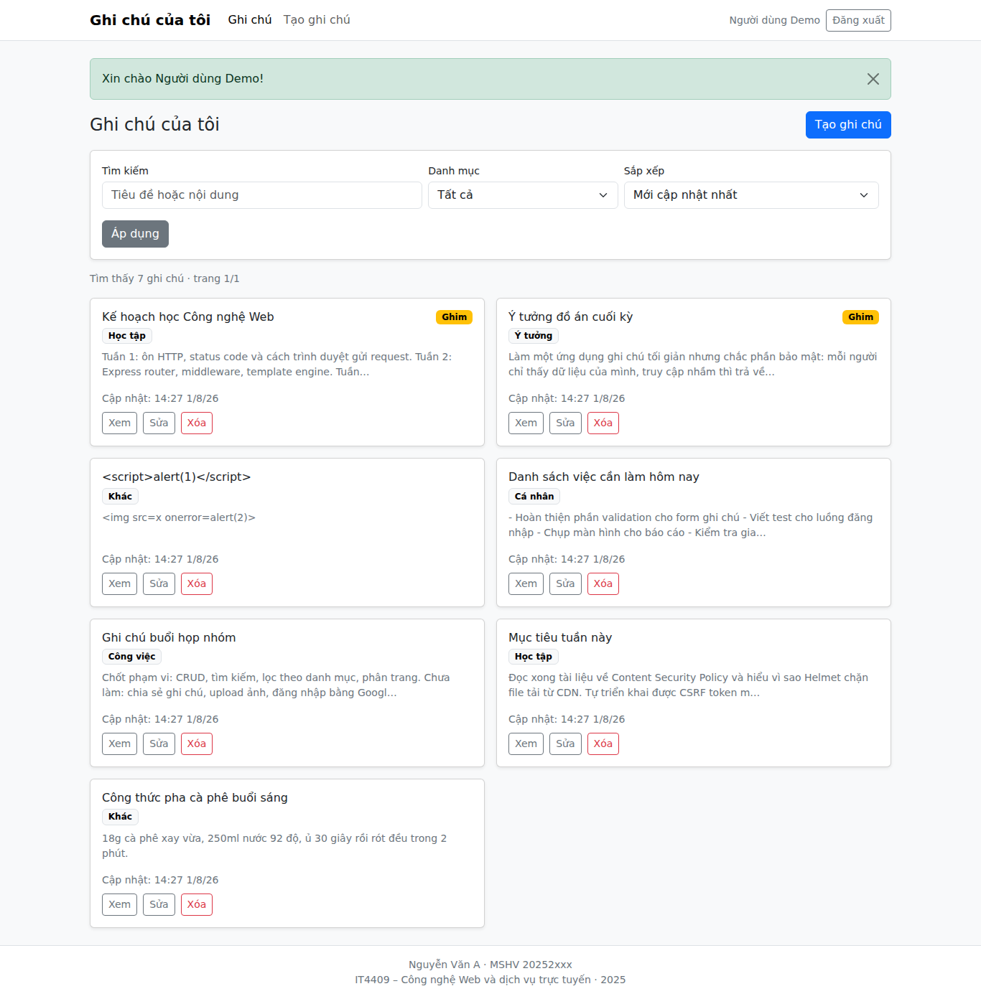

# Note App — Ứng dụng quản lý ghi chú cá nhân

Bài thi cuối kỳ môn **IT4409 – Công nghệ Web và dịch vụ trực tuyến (20252)**.

Ứng dụng web cho phép người dùng đăng ký, đăng nhập và quản lý ghi chú của
riêng mình: tạo, xem danh sách, xem chi tiết, sửa, xóa, tìm kiếm, lọc theo danh
mục, sắp xếp và phân trang.

- Đặc tả kỹ thuật đầy đủ: [Dac-ta-ky-thuat-Note-App-cap-nhat-giao-dien-don-gian.md](./Dac-ta-ky-thuat-Note-App-cap-nhat-giao-dien-don-gian.md)
- Link source code: _(điền link GitHub)_
- Link demo: _(điền link deploy)_

## Tài khoản demo

| Tài khoản | Mật khẩu |
|---|---|
| `20242507M` | `12345678` |

Tài khoản này được seed tự động khi server khởi động, kèm 6 ghi chú mẫu thuộc
nhiều danh mục khác nhau.

Ô đăng nhập nhận cả email lẫn mã học viên: người dùng tự đăng ký qua form thì
dùng email (có kiểm tra định dạng), còn tài khoản demo trên được tạo bằng seed
nên dùng thẳng mã học viên.

## Chức năng

**Xác thực**

- Đăng ký với validation đầy đủ, mật khẩu hash bằng bcrypt.
- Đăng nhập, đăng xuất; đổi session ID sau khi đăng nhập để chống session fixation.
- Thông báo đăng nhập sai là thông báo chung, không tiết lộ email nào đã đăng ký.

**Quản lý ghi chú**

- CRUD đầy đủ: tạo, danh sách, chi tiết, sửa, xóa.
- Phân loại theo 5 danh mục: Cá nhân, Học tập, Công việc, Ý tưởng, Khác.
- Ghim ghi chú quan trọng lên đầu danh sách.
- Tìm kiếm trong tiêu đề và nội dung, **không phân biệt hoa thường và không
  phân biệt dấu** — gõ `hoc` vẫn ra `Học`.
- Lọc theo danh mục, sắp xếp theo 4 tiêu chí, phân trang 10 ghi chú mỗi trang.
- Kết hợp được cả tìm kiếm, lọc và sắp xếp; trạng thái nằm trên URL nên chia sẻ
  và tải lại được.

**Bảo mật**

- Mỗi người dùng chỉ truy cập được dữ liệu của chính mình. Mọi truy vấn ghi chú
  đều ràng buộc `WHERE id = ? AND user_id = ?`.
- Truy cập ghi chú của người khác trả `404` chứ không phải `403`, để không tiết
  lộ ghi chú đó có tồn tại hay không.
- CSRF token cho mọi form thay đổi dữ liệu.
- Escape toàn bộ nội dung người dùng khi render (chống XSS).
- Truy vấn tham số hóa; `category` và `sort` đi qua whitelist (chống SQL injection).
- Helmet đặt security header, cookie `httpOnly` + `sameSite=lax` + `secure` khi
  chạy production.
- `npm audit` sạch, không có lỗ hổng nào.

## Công nghệ

| Thành phần | Lựa chọn |
|---|---|
| Runtime | Node.js 20 LTS trở lên |
| Web framework | Express 5 |
| Template engine | EJS |
| Database | SQLite qua `better-sqlite3` |
| Session | `express-session` + store tự viết trên `better-sqlite3` |
| Hash mật khẩu | `bcrypt` |
| Validation | `express-validator` |
| Security header | `helmet` |
| Logging | `morgan` |
| UI | Bootstrap 5 (self-host) + một file CSS nhỏ |
| Test | Jest + Supertest |

## Kiến trúc

```
Trình duyệt
    │  HTTP
    ▼
Express Router
    │
    ▼
Middleware   (session → locals → csrf → requireAuth)
    │
    ▼
Controller   đọc request, chọn status code, render view
    │
    ▼
Service      quy tắc nghiệp vụ, chuẩn hóa dữ liệu đầu vào
    │
    ▼
Repository   nơi duy nhất viết SQL, luôn ràng buộc user_id
    │
    ▼
SQLite
```

Nguyên tắc: controller không viết SQL, repository không biết gì về HTTP.

```
src/
├── app.js               ráp middleware và router
├── server.js            khởi tạo DB, seed rồi listen
├── config/              env, session, session store
├── database/            schema.sql, kết nối, init, seed
├── routes/              định nghĩa endpoint
├── controllers/         xử lý request/response
├── services/            nghiệp vụ
├── repositories/        truy vấn SQL
├── middleware/          auth, csrf, locals, validation, error handler
├── validators/          quy tắc express-validator
└── utils/               hằng số, chuẩn hóa tìm kiếm, format thời gian
views/                   EJS: partials, auth, notes, errors
public/                  Bootstrap self-host, CSS, JS
tests/                   Jest + Supertest
```

## Yêu cầu môi trường

- Node.js 20 trở lên
- npm 9 trở lên

## Cài đặt và chạy

```bash
npm install
cp .env.example .env
npm run dev
```

Mở http://localhost:3000

Server tự tạo bảng và seed tài khoản demo ngay khi khởi động, nên không cần
chạy thêm bước nào. Nếu muốn làm thủ công:

```bash
npm run db:init    # tạo bảng
npm run db:seed    # tạo tài khoản demo và dữ liệu mẫu
```

## Biến môi trường

| Biến | Mặc định | Ý nghĩa |
|---|---|---|
| `NODE_ENV` | `development` | `production` sẽ bật cookie secure và trust proxy |
| `PORT` | `3000` | Cổng server |
| `SESSION_SECRET` | — | **Bắt buộc ở production.** Chuỗi ngẫu nhiên dài |
| `DATABASE_PATH` | `./data/app.db` | Vị trí file SQLite |
| `BCRYPT_ROUNDS` | `12` | Số vòng hash |
| `DEMO_EMAIL` | `20242507M` | Tài khoản demo (email hoặc mã học viên) |
| `DEMO_PASSWORD` | `12345678` | Mật khẩu tài khoản demo |

Sinh `SESSION_SECRET`:

```bash
node -e "console.log(require('crypto').randomBytes(48).toString('hex'))"
```

File `.env` nằm trong `.gitignore`, chỉ `.env.example` được commit.

## Chạy test

```bash
npm test
```

46 test bao phủ toàn bộ 17 trường hợp kiểm thử trong đặc tả: đăng ký, đăng
nhập, CRUD, phân quyền dữ liệu (IDOR), validation, tìm kiếm không dấu, CSRF,
XSS, ID không hợp lệ và xử lý lỗi hệ thống.

Test chạy trên database `:memory:` nên không đụng vào `data/app.db`.

### Kiểm thử bằng trình duyệt thật (tùy chọn)

Ngoài test ở tầng HTTP, có thêm một bộ 42 kiểm tra chạy trên Chromium thật để
bắt những lỗi mà Supertest không thấy: CSP chặn tài nguyên, lỗi JavaScript, bố
cục tràn ngang trên mobile, hộp thoại xác nhận khi xóa.

```bash
npm install -D playwright
npx playwright install chromium
npm run dev                                    # cửa sổ khác
node tests/e2e/browser.js
```

Script này cũng tự chụp toàn bộ ảnh màn hình vào `docs/screenshots/`. Nó không
nằm trong `npm test` để `npm ci` khi deploy không phải tải trình duyệt.

Bộ này kiểm tra thêm: Bootstrap thực sự được áp dụng (bắt lỗi CSP chặn CSS),
bộ đếm ký tự chạy, nội dung giữ xuống dòng, ghi chú ghim nằm đầu danh sách,
navbar thu gọn ở 360px, danh sách một cột trên mobile và nhiều cột trên
desktop, nút cao tối thiểu 40px, và không có lỗi JavaScript nào trong console.

## Bảng mã trạng thái HTTP

| Mã | Trường hợp |
|---|---|
| 200 | Render trang thành công |
| 302 | Chuyển hướng sau POST thành công, hoặc về `/auth/login` khi chưa đăng nhập |
| 401 | Sai email hoặc mật khẩu ở `POST /auth/login` |
| 403 | CSRF token thiếu hoặc không hợp lệ |
| 404 | Route không tồn tại, hoặc ghi chú không tồn tại/không thuộc người dùng hiện tại |
| 409 | Email đã được đăng ký |
| 422 | Dữ liệu form không hợp lệ |
| 500 | Lỗi hệ thống không dự kiến |

## Kiểm thử phân quyền dữ liệu

Kịch bản đã được tự động hóa trong `tests/notes.test.js` (TC-09, TC-10, TC-11):

1. Đăng nhập bằng hai tài khoản khác nhau (Alice và Bob).
2. Alice tạo một ghi chú, ghi lại id.
3. Bob mở `/notes/:id` của Alice → nhận **404**, nội dung không lộ ra.
4. Bob gửi POST sửa ghi chú đó → nhận **404**, dữ liệu của Alice không đổi
   (kiểm tra cả `updated_at`).
5. Bob gửi POST xóa ghi chú đó → nhận **404**, bản ghi vẫn còn.
6. Danh sách của Bob không chứa ghi chú của Alice.

Có thêm một test xác nhận `user_id` gửi kèm trong form bị bỏ qua hoàn toàn:
ghi chú luôn thuộc về người đang đăng nhập.

## Triển khai

1. Tạo web service trên Render/Railway/Fly.io, trỏ vào repository.
2. Build command: `npm ci` · Start command: `npm start`.
3. Đặt biến môi trường: `NODE_ENV=production`, `SESSION_SECRET` (chuỗi mới),
   `DEMO_PASSWORD`.
4. Deploy. Server tự tạo bảng và seed tài khoản demo khi khởi động.

### Lưu ý về dữ liệu trên bản demo

Gói miễn phí của các nền tảng này **không có ổ đĩa lưu trữ lâu dài**, nên file
SQLite sẽ bị xóa mỗi khi service redeploy hoặc khởi động lại sau thời gian ngủ.
Vì vậy:

- Tài khoản demo và dữ liệu mẫu **luôn có mặt**, do seed chạy lại mỗi lần boot
  và được viết idempotent.
- Ghi chú do người dùng tạo trong lúc demo **có thể mất** sau khi service khởi
  động lại.

Đây là đánh đổi có chủ ý cho một bản demo bài thi. Nếu gắn thêm ổ đĩa, chỉ cần
trỏ `DATABASE_PATH` vào đó là dữ liệu được giữ lâu dài, không phải sửa code.

## Ảnh chụp giao diện

Toàn bộ ảnh nằm trong [docs/screenshots/](./docs/screenshots), sinh tự động
bằng `node tests/e2e/browser.js`.

| Ảnh | Nội dung |
|---|---|
| `01-dang-nhap.png` | Trang đăng nhập kèm thông tin tài khoản demo |
| `02-danh-sach-desktop.png` | Danh sách ghi chú trên desktop, hai cột, ghim lên đầu |
| `03-tim-kiem.png` | Kết quả tìm kiếm |
| `04-khong-co-ket-qua.png` | Trạng thái không có kết quả kèm nút xóa bộ lọc |
| `05-form-tao.png` | Form tạo ghi chú với bộ đếm ký tự |
| `06-chi-tiet.png` | Trang chi tiết, nội dung giữ xuống dòng |
| `07-validation.png` | Lỗi validation hiển thị ngay dưới ô nhập |
| `08-404.png` | Trang 404 |
| `09-danh-sach-mobile.png` | Danh sách trên mobile 360px, một cột |
| `10-form-mobile.png` | Form trên mobile |



## Tác giả

- Họ tên: _(điền)_
- MSHV: _(điền)_
- Email: _(điền)_
- Môn học: IT4409 – Công nghệ Web và dịch vụ trực tuyến, 2025
