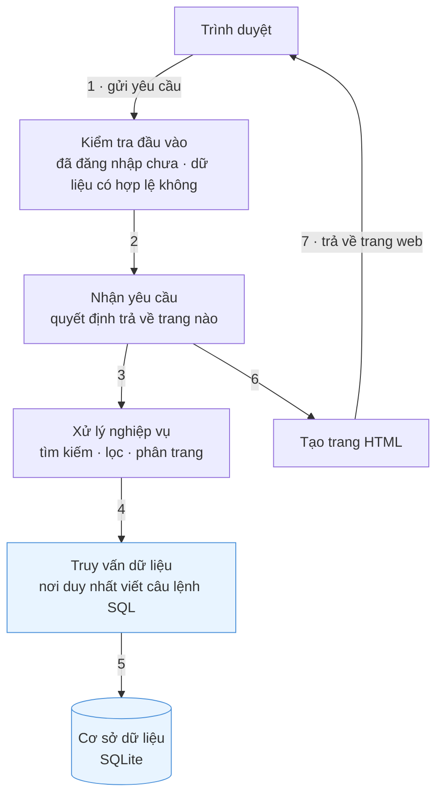
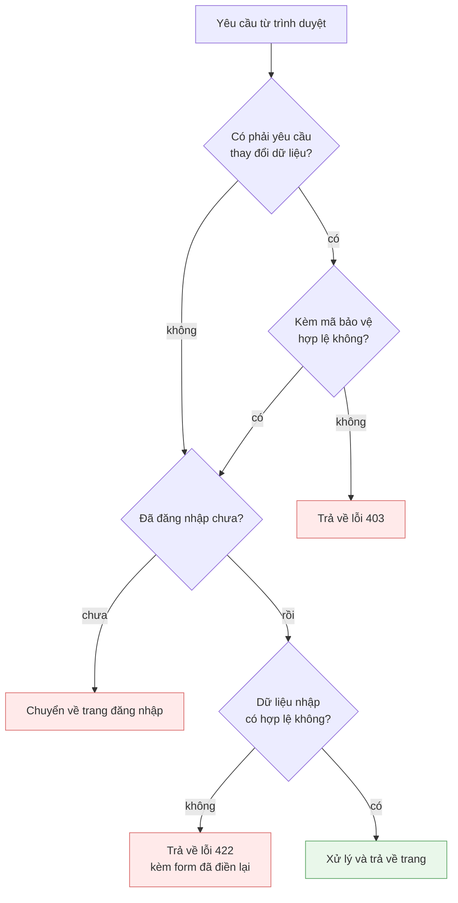
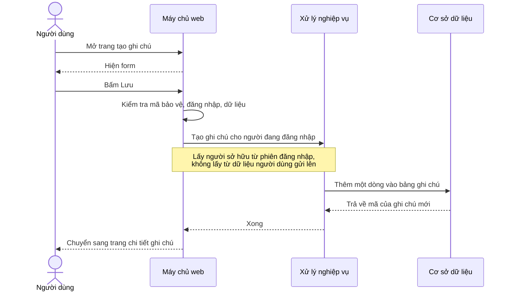
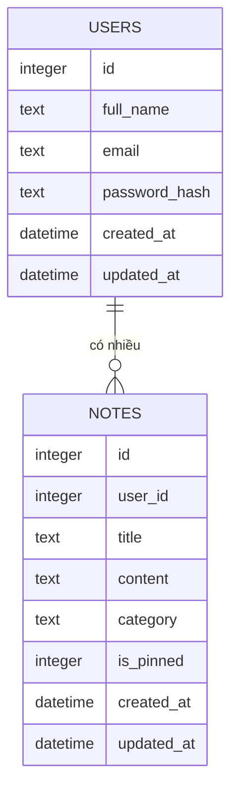

# Sơ đồ kiến trúc — Note App (IT4409)

Xem trực tiếp: mở file này trong VS Code rồi bấm `Ctrl+Shift+V`, hoặc xem trên
GitHub — cả hai đều tự vẽ sơ đồ Mermaid.

---

## 1. Sơ đồ tổng quát

Ứng dụng chia làm các lớp, mỗi lớp làm đúng một việc và chỉ gọi lớp ngay dưới nó.



Hai điểm quan trọng nhất của cách chia này:

1. **Chỉ một chỗ viết SQL.** Toàn bộ câu lệnh truy vấn nằm trong lớp "Truy vấn
   dữ liệu". Khi cần kiểm tra dữ liệu người dùng có bị lộ hay không thì chỉ phải
   đọc đúng chỗ đó.
2. **Lớp truy vấn không biết gì về web,** lớp nhận yêu cầu không tự viết SQL.
   Sửa một lớp không làm ảnh hưởng lớp khác.

Tên gọi trong code: lớp nhận yêu cầu là *controller*, xử lý nghiệp vụ là
*service*, truy vấn dữ liệu là *repository*.

---

## 2. Các bước kiểm tra trước khi xử lý

Mỗi yêu cầu phải đi qua lần lượt các bước sau. Bước nào không đạt thì dừng ngay
tại đó và trả về mã lỗi tương ứng.



"Mã bảo vệ" ở đây là **CSRF token** — một chuỗi ngẫu nhiên server gắn vào mỗi
form, khi nhận lại thì so xem có đúng chuỗi đã gắn hay không. Mục đích: chặn
trang web khác giả mạo yêu cầu thay mặt người dùng.

---

## 3. Luồng tạo một ghi chú



Điểm cần nhấn: người sở hữu ghi chú được lấy từ **phiên đăng nhập** ở phía
server, nên dù người dùng có tự thêm trường ẩn vào form để mạo danh người khác
cũng không có tác dụng.

---

## 4. Mô hình dữ liệu

Hai bảng chính, quan hệ một người dùng có nhiều ghi chú.



Tên cột giữ đúng như trong cơ sở dữ liệu. Nghĩa của các cột: `full_name` họ tên,
`password_hash` mật khẩu đã mã hóa, `title` tiêu đề, `content` nội dung,
`category` danh mục, `is_pinned` có ghim hay không, `created_at` ngày tạo,
`updated_at` ngày cập nhật.

- Cột `user_id` trong bảng ghi chú cho biết ghi chú thuộc về ai. **Mọi câu truy
  vấn ghi chú đều kèm điều kiện cột này**, nhờ vậy người dùng không thể đọc dữ
  liệu của nhau.
- Xóa một người dùng thì ghi chú của họ tự xóa theo.
- Mật khẩu lưu dưới dạng đã mã hóa một chiều, không thể đọc lại thành mật khẩu gốc.
- Bảng ghi chú còn một cột phụ lưu bản tiêu đề và nội dung đã bỏ dấu, chỉ dùng
  cho việc tìm kiếm không dấu.
- Ngoài hai bảng trên còn một bảng nhỏ lưu phiên đăng nhập, không liên quan
  nghiệp vụ.

---

## 5. Bản đồ thư mục

```
src/
├── server.js          khởi động máy chủ
├── app.js             lắp các bước kiểm tra và các đường dẫn
├── config/            cấu hình, phiên đăng nhập
├── database/          tạo bảng, dữ liệu mẫu
├── routes/            khai báo các đường dẫn
├── controllers/       nhận yêu cầu, chọn trang trả về
├── services/          xử lý nghiệp vụ
├── repositories/      câu lệnh SQL, luôn kèm user_id
├── middleware/        kiểm tra đăng nhập, mã bảo vệ, xử lý lỗi
├── validators/        quy tắc kiểm tra dữ liệu nhập
└── utils/             hàm dùng chung

views/                 các trang HTML
public/                CSS, JavaScript, thư viện giao diện
tests/                 kiểm thử tự động
docs/                  tài liệu và ảnh chụp
```
