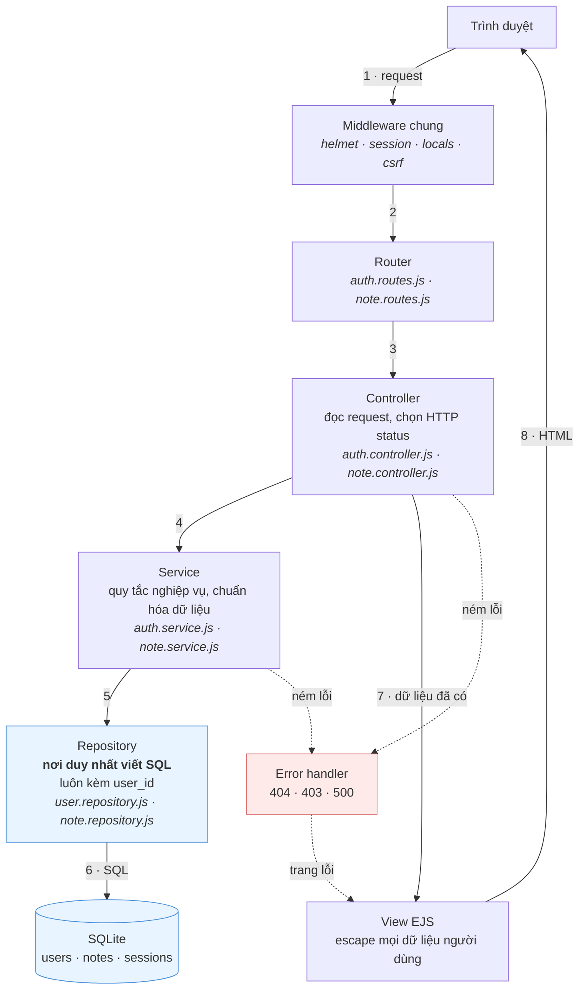
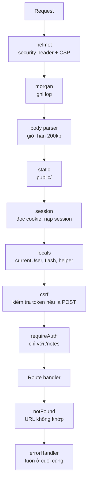
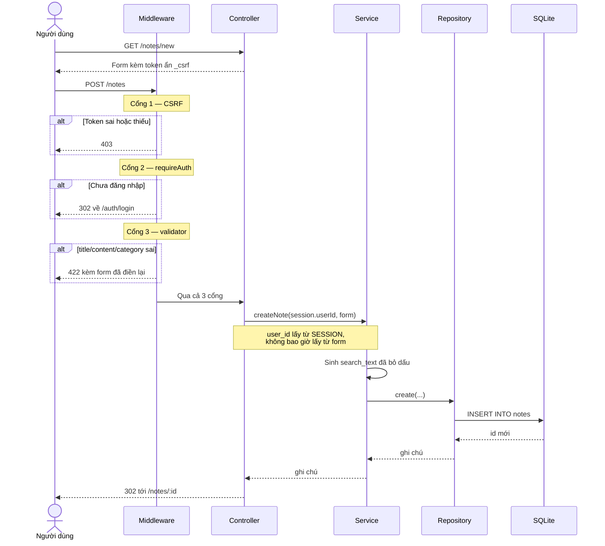
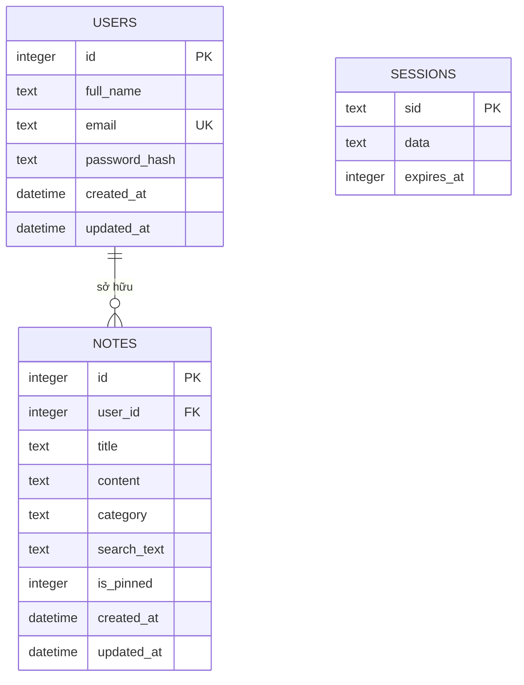

# Sơ đồ kiến trúc — Note App (IT4409)

Xem trực tiếp: mở file này trong VS Code rồi bấm `Ctrl+Shift+V`, hoặc xem trên
GitHub — cả hai đều tự vẽ sơ đồ Mermaid.

---

## 1. Sơ đồ tổng quát

Toàn bộ ứng dụng chia làm 5 tầng. Quy tắc xuyên suốt: **mỗi tầng chỉ nói chuyện
với tầng ngay dưới nó**, controller không bao giờ viết SQL, repository không
bao giờ biết gì về HTTP.



Đường đi chính là 1→8. Kết quả truy vấn quay ngược lên theo đúng chuỗi gọi hàm
(repository trả về service, service trả về controller) nên không vẽ mũi tên
ngược cho đỡ rối.

**Vì sao chia tầng như vậy:** khi cần biết "dữ liệu của người dùng có bị lộ
không", chỉ phải đọc đúng 2 file repository chứ không phải rà cả dự án. Mọi câu
truy vấn ghi chú đều nằm ở một chỗ và đều có `WHERE ... AND user_id = ?`.

---

## 2. Chuỗi middleware — thứ tự rất quan trọng

Đây là thứ tự đăng ký thật trong `src/app.js`. Đảo thứ tự là hỏng.



Ba ràng buộc về thứ tự cần nhớ:

| Ràng buộc | Lý do |
|---|---|
| `body parser` phải trước `csrf` | `csrf` đọc `req.body._csrf`, chưa parse thì chưa có |
| `session` phải trước `locals` và `csrf` | Cả hai đều đọc/ghi vào `req.session` |
| `errorHandler` phải cuối cùng | Express chỉ nhận diện error handler qua 4 tham số và chỉ gọi khi mọi thứ trước đó đã bỏ qua |

---

## 3. Luồng một request cụ thể — tạo ghi chú



Điểm cần chỉ ra khi vấn đáp: có **bốn lớp chặn** trước khi dữ liệu chạm database
— CSRF, đăng nhập, validation, rồi mới tới nghiệp vụ. Và `user_id` được lấy từ
session ở tầng controller, nên dù người dùng có thêm trường ẩn `user_id` vào
form cũng vô tác dụng.

---

## 4. Mô hình dữ liệu



- `notes.user_id` có khóa ngoại `ON DELETE CASCADE`: xóa người dùng thì ghi chú
  của họ tự mất theo.
- `search_text` là bản `title + content` đã viết thường và bỏ dấu, chỉ phục vụ
  tìm kiếm, không bao giờ hiển thị ra giao diện.
- Bảng `sessions` do session store tự viết quản lý, không liên quan nghiệp vụ.
- Hai index: `(user_id, updated_at)` cho danh sách mặc định và
  `(user_id, category)` cho bộ lọc.

---

## 5. Bản đồ thư mục

```
src/
├── server.js          khởi tạo DB, seed, rồi listen
├── app.js             ráp middleware và router theo đúng thứ tự
├── config/            biến môi trường, session, session store
├── database/          schema.sql, kết nối, init, seed
├── routes/            khai báo endpoint, gắn middleware cho từng route
├── controllers/       đọc request, chọn status code, render view
├── services/          nghiệp vụ: phân trang, chuẩn hóa tìm kiếm, ném 404
├── repositories/      SQL, luôn kèm user_id
├── middleware/        auth, csrf, locals, validation, xử lý lỗi
├── validators/        quy tắc express-validator
└── utils/             hằng số, bỏ dấu tiếng Việt, format thời gian, AppError

views/                 EJS: partials, auth, notes, errors
public/                Bootstrap tự host, CSS, JS phía client
tests/                 Jest + Supertest, và bộ E2E chạy trên Chromium
```
