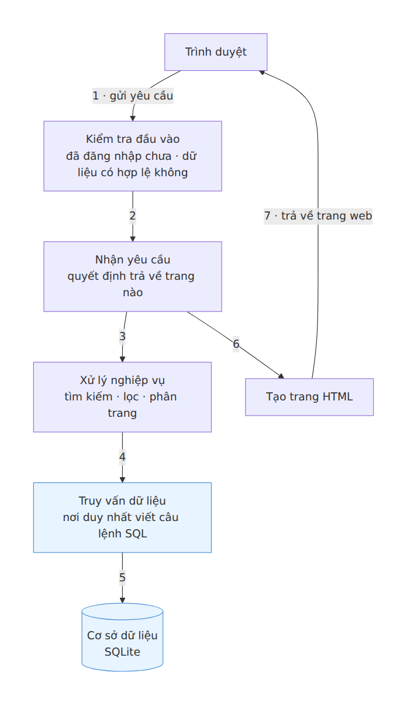
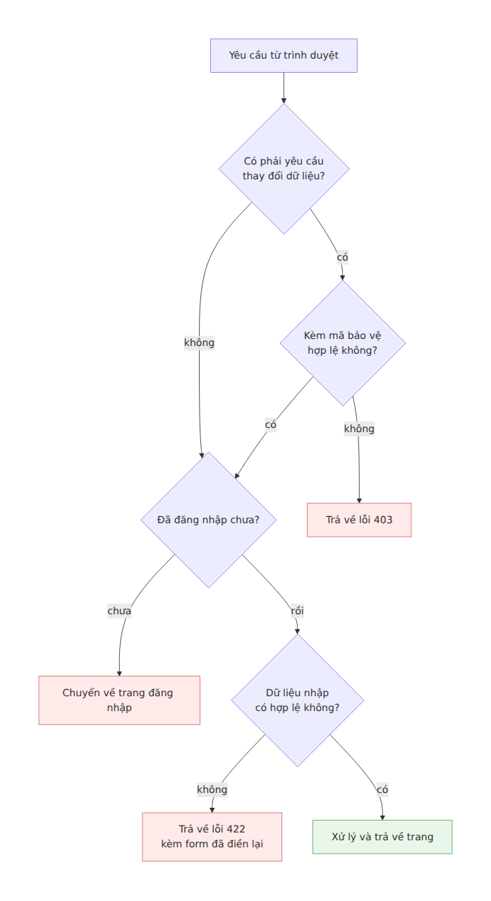
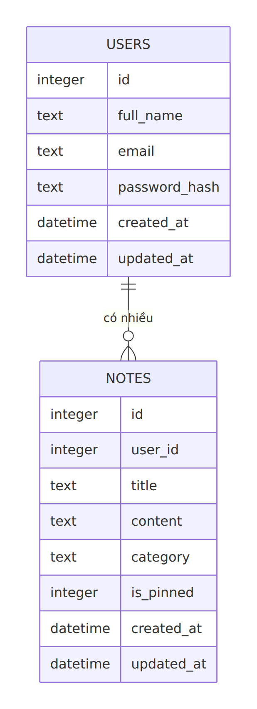
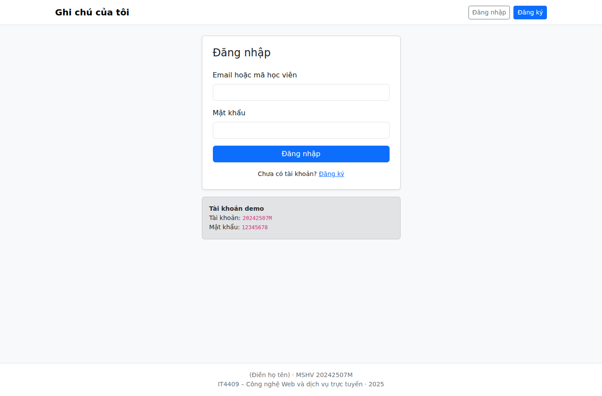
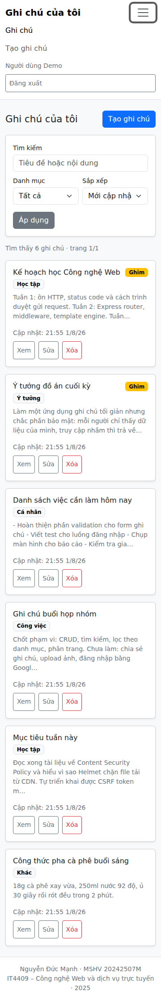
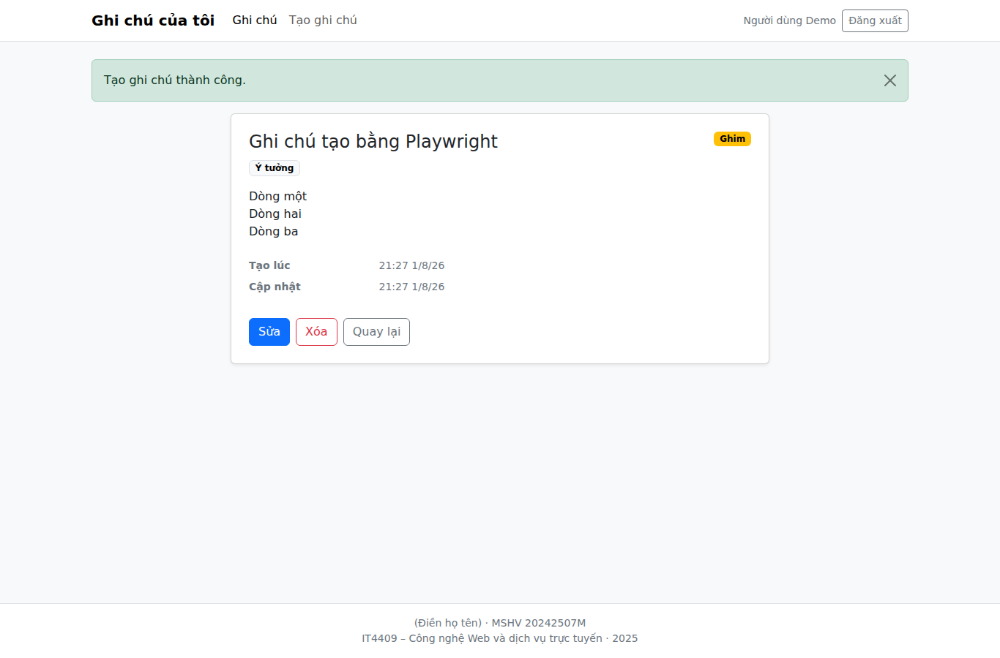
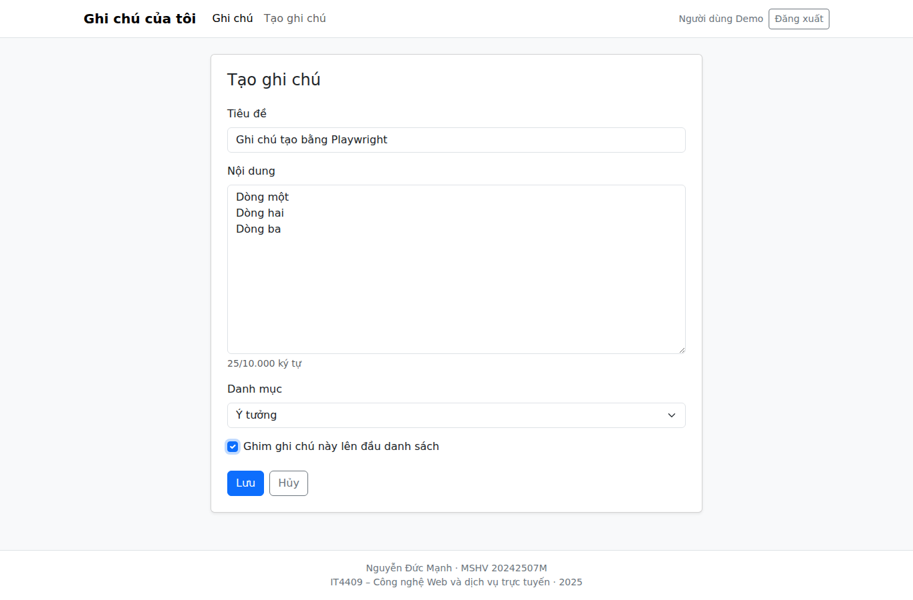
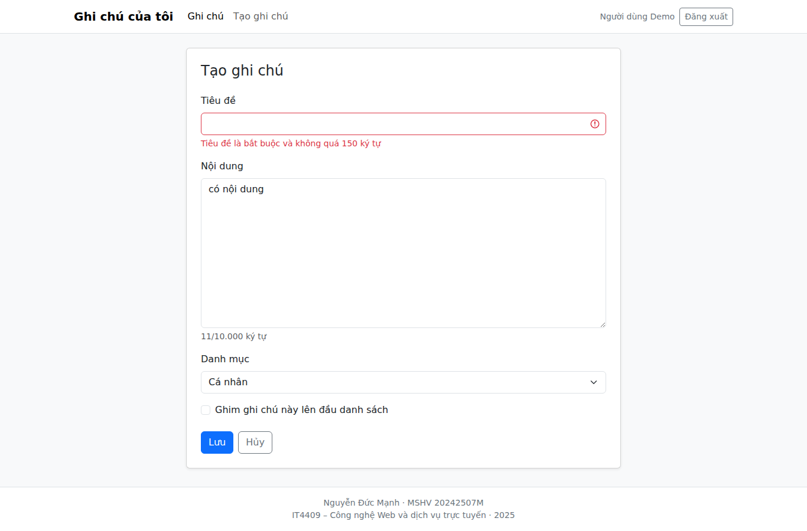
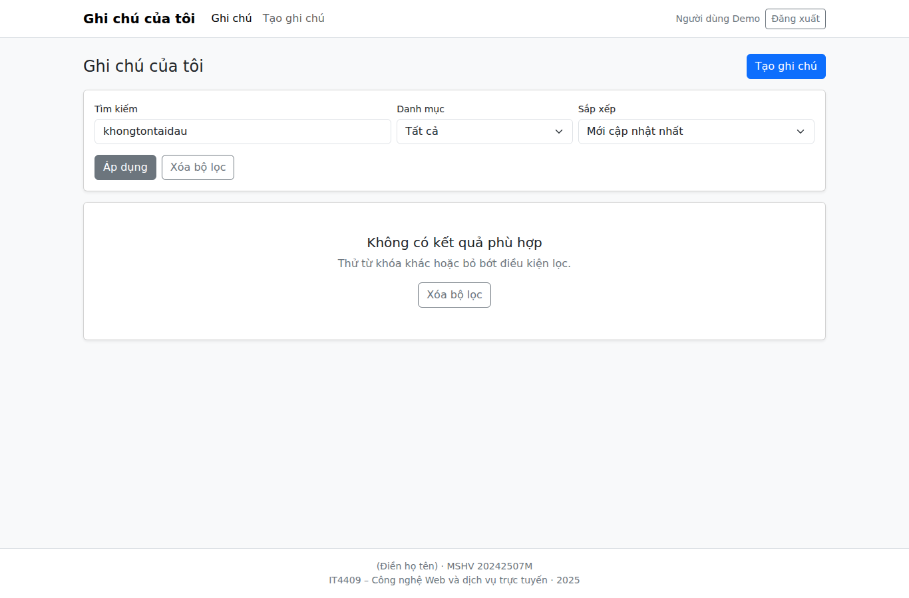
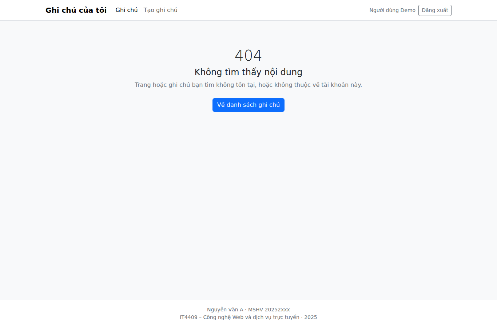

# BÁO CÁO BÀI THI CUỐI KỲ

<!--
  Tệp nguồn của báo cáo nộp bài.
  Xuất ra PDF với tên: [IT4409]_CuoiKy20252_20242507M_NguyenDucManh.pdf
-->

**Môn học:** IT4409 – Công nghệ Web và dịch vụ trực tuyến (20252)

**Đề tài:** Chủ đề 2 — Quản lý ghi chú (Note App)

---

## 1. Thông tin học viên

| | |
|---|---|
| **Họ tên** | Nguyễn Đức Mạnh |
| **Mã số học viên** | 20242507M |
| **Email** | manh.nd242507m@sis.hust.edu.vn |

---

## 2. Liên kết và tài khoản truy cập

| | |
|---|---|
| **Source code** | https://github.com/Dubu0312/cong-nghe-web |
| **Demo đã triển khai** | https://cnw.shibie.org |

Có **hai tài khoản** để giảng viên kiểm chứng phân quyền dữ liệu ngay trên giao
diện:

| Tài khoản | Mật khẩu | Dữ liệu |
|---|---|---|
| `20242507M` | `12345678` | 6 ghi chú |
| `user_test` | `12345678` | 5 ghi chú khác hoàn toàn |

Ô đăng nhập nhận cả email lẫn mã học viên. Cả hai tài khoản được tạo tự động khi
server khởi động.

**Cách kiểm chứng nhanh mỗi người chỉ thấy dữ liệu của mình:** đăng nhập bằng
`user_test`, mở ghi chú đầu tiên và sao chép URL. Đăng xuất, đăng nhập bằng
`20242507M` rồi dán lại URL đó — kết quả là trang **404**, đúng như thiết kế.

---

## 3. Mô tả chức năng

### 3.1. Xác thực người dùng

- **Đăng ký** với kiểm tra dữ liệu đầy đủ: họ tên 2–100 ký tự, email đúng định
  dạng và không trùng, mật khẩu tối thiểu 8 ký tự, xác nhận mật khẩu phải khớp.
- **Đăng nhập / đăng xuất.** Mật khẩu được hash bằng bcrypt 12 vòng, không bao
  giờ lưu dạng thô. Session ID được tạo lại sau khi đăng nhập thành công để
  chống tấn công session fixation.
- Thông báo đăng nhập sai là thông báo chung cho cả hai trường hợp sai email và
  sai mật khẩu, nhằm không tiết lộ email nào đã được đăng ký.

### 3.2. Quản lý ghi chú (CRUD)

| Thao tác | Mô tả |
|---|---|
| **Tạo** | Form gồm tiêu đề, nội dung, danh mục và tùy chọn ghim |
| **Xem danh sách** | Dạng thẻ, phân trang 10 ghi chú mỗi trang |
| **Xem chi tiết** | Hiển thị đầy đủ nội dung, giữ nguyên định dạng xuống dòng |
| **Sửa** | Form điền sẵn dữ liệu cũ, cập nhật thời điểm sửa |
| **Xóa** | Có hộp thoại xác nhận trước khi thực hiện |

### 3.3. Phân loại, tìm kiếm và sắp xếp

- **Phân loại:** 5 danh mục — Cá nhân, Học tập, Công việc, Ý tưởng, Khác.
- **Tìm kiếm** trong cả tiêu đề và nội dung, không phân biệt hoa thường **và
  không phân biệt dấu tiếng Việt** — gõ `hoc` vẫn tìm được ghi chú viết `Học`.
- **Lọc** theo danh mục, **sắp xếp** theo 4 tiêu chí (mới/cũ cập nhật, mới tạo,
  tiêu đề A–Z). Ghi chú được ghim luôn đứng đầu ở mọi kiểu sắp xếp.
- Kết hợp được đồng thời tìm kiếm, lọc và sắp xếp. Trạng thái nằm trên URL nên
  chia sẻ và tải lại được.

### 3.4. Phân quyền dữ liệu

Mỗi người dùng chỉ truy cập được ghi chú của chính mình. Chi tiết cách triển
khai và kết quả kiểm thử ở mục 8.

### 3.5. Giao diện

- Responsive từ 360px: navbar thu gọn, danh sách chuyển từ nhiều cột sang một
  cột, form không tràn ngang, nút thao tác có vùng chạm tối thiểu 40px.
- Có đầy đủ trạng thái: danh sách rỗng, không có kết quả tìm kiếm, trang 404,
  trang 500 thân thiện.
- Lỗi validation hiển thị ngay dưới từng ô nhập và giữ lại dữ liệu đã gõ.

---

## 4. Công nghệ sử dụng

| Thành phần | Công nghệ | Lý do chọn |
|---|---|---|
| Runtime | Node.js 20+ | Dùng chung một ngôn ngữ cho cả server và client |
| Web framework | Express 5 | Nhẹ, kiểm soát rõ từng lớp middleware |
| Template engine | EJS | Render HTML phía server, tự escape dữ liệu người dùng |
| Cơ sở dữ liệu | SQLite (better-sqlite3) | Dữ liệu nhỏ, không cần server database riêng |
| Session | express-session + store tự viết | Xem ghi chú bên dưới |
| Hash mật khẩu | bcrypt | Tự sinh salt riêng cho mỗi mật khẩu |
| Validation | express-validator | Kiểm tra dữ liệu ở phía server |
| Security header | helmet | Đặt CSP và các header bảo mật |
| Logging | morgan | Ghi log request |
| Giao diện | Bootstrap 5 (tự host) | Responsive nhanh, không phụ thuộc CDN |
| Kiểm thử | Jest + Supertest + Playwright | Kiểm thử ở tầng HTTP và trên trình duyệt thật |

**Ghi chú về session store:** phương án thông thường là `connect-sqlite3`, nhưng
package này khóa phụ thuộc ở `sqlite3` bản 5, kéo theo `node-gyp` và `tar` phiên
bản cũ khiến `npm audit` báo 7 lỗ hổng trong đó có một mức critical, và
`npm audit fix` không gỡ được. Vì `express-session` chỉ yêu cầu ba phương thức
`get`/`set`/`destroy`, em tự viết store dùng chung `better-sqlite3` có sẵn. Kết
quả là dự án chỉ dùng một driver SQLite và `npm audit` không còn lỗ hổng nào.

**Ghi chú về Bootstrap:** helmet bật sẵn Content-Security-Policy với
`default-src 'self'`, nghĩa là trình duyệt chặn mọi tệp CSS/JS tải từ tên miền
khác. Vì vậy Bootstrap được tải về đặt trong `public/vendor/` thay vì nhúng từ
CDN — giữ được chính sách bảo mật mặc định mà giao diện vẫn hoạt động.

---

## 5. Sơ đồ kiến trúc

Ứng dụng chia thành các lớp, mỗi lớp làm đúng một việc và chỉ gọi lớp ngay dưới
nó.



Một yêu cầu đi theo thứ tự: trình duyệt gửi yêu cầu, hệ thống kiểm tra đã đăng
nhập và dữ liệu có hợp lệ hay không, rồi chuyển cho lớp nhận yêu cầu. Lớp này
gọi lớp xử lý nghiệp vụ, lớp nghiệp vụ gọi lớp truy vấn dữ liệu để đọc hoặc ghi
vào cơ sở dữ liệu. Cuối cùng hệ thống tạo trang HTML và trả về trình duyệt.

Hai điểm quan trọng của cách chia này:

1. **Chỉ có một chỗ viết câu lệnh SQL** — lớp truy vấn dữ liệu. Nhờ vậy khi cần
   kiểm tra dữ liệu người dùng có bị lộ hay không thì chỉ phải xem đúng chỗ đó
   thay vì rà cả dự án.
2. **Mọi lỗi đều đổ về một chỗ xử lý duy nhất** đặt ở cuối, nơi quyết định hiển
   thị trang 404, 403 hay 500. Không phải rải rác việc bắt lỗi ở khắp nơi.

Trong mã nguồn, ba lớp giữa lần lượt có tên là *controller* (nhận yêu cầu),
*service* (xử lý nghiệp vụ) và *repository* (truy vấn dữ liệu).

### Các bước kiểm tra một yêu cầu



Bước nào không đạt thì dừng ngay tại đó và trả về mã lỗi tương ứng, không đi
tiếp xuống các lớp dưới.

### Mô hình dữ liệu



Quan hệ: một người dùng có nhiều ghi chú. Cột `user_id` trong bảng ghi chú cho
biết ghi chú thuộc về ai, và **mọi câu truy vấn ghi chú đều kèm điều kiện cột
này** — đây là cơ chế bảo đảm người dùng không đọc được dữ liệu của nhau. Xóa
một người dùng thì ghi chú của họ tự xóa theo.

Ngoài các cột trong sơ đồ, bảng ghi chú còn một cột phụ lưu bản tiêu đề và nội
dung đã bỏ dấu để phục vụ tìm kiếm không dấu, và cơ sở dữ liệu có thêm một bảng
nhỏ lưu phiên đăng nhập. Hai bảng được đánh chỉ mục theo `user_id` kèm thời điểm
cập nhật và theo `user_id` kèm danh mục, giúp truy vấn danh sách và bộ lọc nhanh
hơn khi dữ liệu nhiều.

---

## 6. Hướng dẫn chạy

### 6.1. Yêu cầu môi trường

- Node.js 20 trở lên
- npm 9 trở lên

### 6.2. Chạy trên máy cá nhân

```bash
git clone https://github.com/Dubu0312/cong-nghe-web.git
cd cong-nghe-web
npm install
cp .env.example .env
npm run dev
```

Mở http://localhost:3000 và đăng nhập bằng tài khoản demo ở mục 2.

Không cần chạy thêm bước khởi tạo cơ sở dữ liệu — server tự tạo bảng và tạo tài
khoản demo khi khởi động. Nếu muốn làm thủ công thì có `npm run db:init` và
`npm run db:seed`.

### 6.3. Biến môi trường

| Biến | Mặc định | Ý nghĩa |
|---|---|---|
| `NODE_ENV` | `development` | Đặt `production` khi triển khai |
| `PORT` | `3000` | Cổng server |
| `HOST` | `0.0.0.0` | Nghe trên mọi network interface |
| `SESSION_SECRET` | — | **Bắt buộc khi production.** Chuỗi ngẫu nhiên dài |
| `DATABASE_PATH` | `./data/app.db` | Vị trí tệp SQLite |
| `BCRYPT_ROUNDS` | `12` | Số vòng hash mật khẩu |
| `DEMO_EMAIL` | `20242507M` | Tài khoản demo |
| `DEMO_PASSWORD` | `12345678` | Mật khẩu tài khoản demo |

### 6.4. Chạy kiểm thử

```bash
npm test
```

---

## 7. Danh sách mã trạng thái HTTP đã xử lý

| Mã | Trường hợp phát sinh |
|---|---|
| **200** | Render trang thành công |
| **302** | Chuyển hướng sau POST thành công; chuyển về trang đăng nhập khi chưa xác thực; chuyển về danh sách khi người đã đăng nhập mở lại trang login/register |
| **401** | Sai email hoặc mật khẩu tại `POST /auth/login` |
| **403** | CSRF token thiếu hoặc không hợp lệ |
| **404** | Route không tồn tại; ghi chú không tồn tại; ghi chú không thuộc người dùng hiện tại; `:id` sai định dạng |
| **409** | Email đã được đăng ký khi tạo tài khoản |
| **422** | Dữ liệu form không hợp lệ |
| **500** | Lỗi hệ thống không dự kiến, có ghi log ở server nhưng không lộ stack trace ra trình duyệt |

### Hai mã cố ý không sử dụng

- **400 Bad Request:** mọi lỗi dữ liệu đầu vào đã quy về `422`, còn `:id` sai
  định dạng quy về `404`. Giữ một quy ước duy nhất giúp hành vi dễ đoán và dễ
  kiểm thử.
- **403 Forbidden cho quyền sở hữu dữ liệu:** trả `403` khi người dùng truy cập
  ghi chú của người khác sẽ vô tình xác nhận ghi chú đó tồn tại. Vì vậy trường
  hợp này quy về `404`; mã `403` chỉ dùng cho lỗi CSRF.

Bảng đầy đủ 13 endpoint kèm tham số đầu vào có trong tệp `docs/api.md` của
repository.

---

## 8. Ghi chú kiểm thử phân quyền dữ liệu

### 8.1. Cách triển khai

Nguyên tắc: **không có truy vấn nào chỉ lọc theo `id`.** Mọi câu lệnh trong
`note.repository.js` đều ràng buộc thêm `user_id`, và giá trị `user_id` luôn lấy
từ session chứ không bao giờ từ dữ liệu người dùng gửi lên.

```sql
-- Xem chi tiết
SELECT ... FROM notes WHERE id = ? AND user_id = ?;

-- Cập nhật
UPDATE notes SET ... WHERE id = ? AND user_id = ?;

-- Xóa
DELETE FROM notes WHERE id = ? AND user_id = ?;
```

Với `UPDATE` và `DELETE`, nếu số dòng bị ảnh hưởng bằng 0 thì hệ thống trả
`404`. Nhờ vậy việc chống truy cập trái phép nằm ngay ở tầng dữ liệu, không phụ
thuộc vào việc controller có nhớ kiểm tra hay không.

### 8.2. Kịch bản kiểm thử và kết quả

Đã được tự động hóa trong `tests/notes.test.js` (các trường hợp TC-09, TC-10,
TC-11):

| Bước | Hành động | Kết quả mong đợi | Kết quả thực tế |
|---|---|---|---|
| 1 | Đăng nhập bằng hai tài khoản khác nhau (A và B) | — | ✔ |
| 2 | A tạo một ghi chú, ghi lại `id` | — | ✔ |
| 3 | B mở `GET /notes/:id` của A | `404`, không lộ nội dung | ✔ |
| 4 | B mở `GET /notes/:id/edit` của A | `404` | ✔ |
| 5 | B gửi `POST /notes/:id` sửa ghi chú của A | `404`, dữ liệu A không đổi | ✔ |
| 6 | B gửi `POST /notes/:id/delete` xóa ghi chú của A | `404`, bản ghi vẫn còn | ✔ |
| 7 | Kiểm tra danh sách của B | Không chứa ghi chú của A | ✔ |

Ở bước 5, phép kiểm tra so sánh cả `title`, `content` và `updated_at` trước và
sau khi B gửi yêu cầu, để chắc chắn dữ liệu của A không bị chạm tới.

### 8.3. Kiểm chứng trực tiếp trên bản demo

Ngoài kiểm thử tự động, bản demo có sẵn hai tài khoản với dữ liệu riêng để kiểm
chứng bằng tay. Kết quả đo trên hệ thống đang chạy:

| Kiểm tra | Kết quả |
|---|---|
| Số ghi chú `20242507M` nhìn thấy | 6 |
| Số ghi chú `user_test` nhìn thấy | 5 |
| `20242507M` có thấy ghi chú nào của `user_test` trong danh sách | Không |
| `user_test` có thấy ghi chú nào của `20242507M` trong danh sách | Không |
| `user_test` mở ghi chú của chính mình | `200` |
| `20242507M` mở cùng URL ghi chú đó | `404` |
| `20242507M` gửi yêu cầu sửa ghi chú đó | `404`, dữ liệu không đổi |
| `20242507M` gửi yêu cầu xóa ghi chú đó | `404`, bản ghi vẫn còn |
| Tìm kiếm từ khóa chỉ có trong dữ liệu tài khoản kia | Không trả về kết quả |

### 8.4. Kiểm thử bổ sung

- **Không nhận `user_id` từ form:** một trường hợp kiểm thử gửi kèm
  `user_id` của người dùng khác trong body của `POST /notes`. Ghi chú tạo ra
  vẫn thuộc về người đang đăng nhập, trường gửi lên bị bỏ qua hoàn toàn.
- **`:id` sai định dạng:** các giá trị `abc`, `-1`, `1.5`, `0` đều trả `404`.
- **Chống XSS:** ghi chú có tiêu đề `<script>alert('xss')</script>` được hiển
  thị dưới dạng văn bản, không được trình duyệt thực thi.
- **Chống SQL injection:** giá trị `category` và `sort` đi qua whitelist; gửi
  `sort=; DROP TABLE notes; --` không gây lỗi và dữ liệu vẫn nguyên.
- **CSRF:** mọi form thay đổi dữ liệu đều mang token; gửi POST thiếu token trả
  `403`.

---

## 9. Kết quả kiểm thử tự động

| Bộ kiểm thử | Phạm vi | Kết quả |
|---|---|---|
| Jest + Supertest | 51 trường hợp ở tầng HTTP, chạy trên database trong RAM | 51/51 đạt |
| Kiểm chứng mã trạng thái | 50 request thật đối chiếu với tài liệu endpoint | 50/50 đạt |
| Playwright (Chromium) | 42 kiểm tra trên trình duyệt thật, gồm responsive 360/768/1366px | 42/42 đạt |
| `npm audit` | Lỗ hổng phụ thuộc | 0 lỗ hổng |

Bộ Playwright kiểm tra được những lỗi mà kiểm thử tầng HTTP không phát hiện
được, ví dụ CSS có thực sự được áp dụng hay không, bố cục có tràn ngang trên
mobile hay không, và hộp thoại xác nhận khi xóa có hiện ra hay không.

---

## 10. Ảnh chụp màn hình

### Trang đăng nhập



### Danh sách ghi chú trên desktop


### Danh sách ghi chú trên mobile (360px)



### Trang chi tiết ghi chú



### Form tạo ghi chú



### Lỗi validation hiển thị dưới ô nhập



### Trạng thái không có kết quả tìm kiếm



### Trang 404



---

## 11. Cấu trúc thư mục

```
src/
├── server.js          khởi tạo database, seed, rồi lắng nghe
├── app.js             ráp middleware và router theo đúng thứ tự
├── config/            biến môi trường, session, session store
├── database/          schema.sql, kết nối, khởi tạo, seed
├── routes/            khai báo endpoint
├── controllers/       đọc request, chọn mã trạng thái, render view
├── services/          nghiệp vụ: phân trang, chuẩn hóa tìm kiếm
├── repositories/      truy vấn SQL, luôn kèm user_id
├── middleware/        auth, csrf, locals, validation, xử lý lỗi
├── validators/        quy tắc express-validator
└── utils/             hằng số, bỏ dấu tiếng Việt, định dạng thời gian

views/                 EJS: partials, auth, notes, errors
public/                Bootstrap tự host, CSS, JavaScript phía client
tests/                 Jest + Supertest, và bộ kiểm thử trên trình duyệt
docs/                  tài liệu kiến trúc, tham chiếu endpoint, ảnh chụp
```

---

## 12. Giới hạn đã biết

Nêu ra để minh bạch thay vì bỏ qua:

- **Lưu trữ dữ liệu:** cơ sở dữ liệu là một tệp SQLite. Nếu nền tảng triển khai
  không có ổ đĩa lưu trữ lâu dài thì ghi chú do người dùng tạo trong lúc demo có
  thể mất khi service khởi động lại. Tài khoản demo và dữ liệu mẫu thì luôn tồn
  tại vì hàm seed được viết idempotent và chạy lại mỗi lần khởi động.
- **Hiệu năng tìm kiếm:** tìm kiếm dùng `LIKE '%...%'` nên không sử dụng được
  index. Với quy mô bài này thì không ảnh hưởng; nếu dữ liệu lớn lên thì bước
  tiếp theo là chuyển sang FTS5 của SQLite.
- **Chưa có giới hạn số lần đăng nhập sai.** Đây là phần nằm ngoài phạm vi đề
  bài, nếu bổ sung sẽ dùng `express-rate-limit` cho `POST /auth/login` và trả mã
  `429`.
