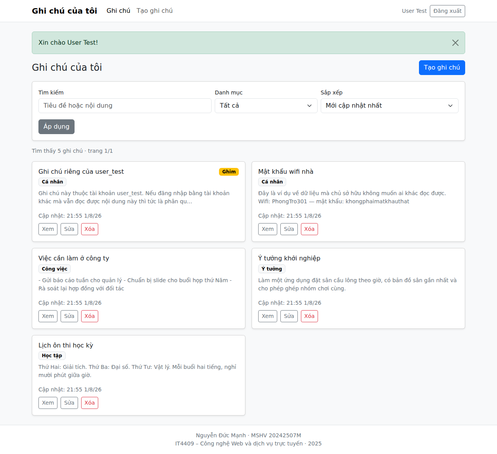
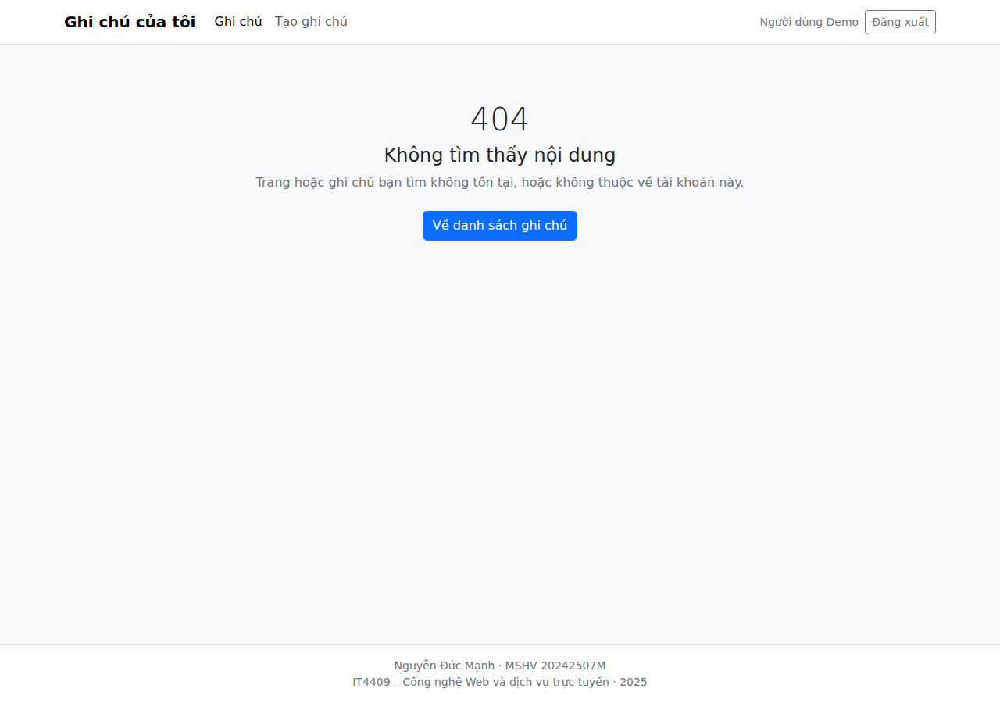

# BÁO CÁO BÀI THI CUỐI KỲ

<!--
  Tệp nguồn của báo cáo nộp bài.
  Xuất ra PDF với tên: [IT4409]_CuoiKy20252_20242507M_NguyenDucManh.pdf
-->

**Môn học:** IT4409 – Công nghệ Web và dịch vụ trực tuyến (20252)

**Đề tài:** Chủ đề 2 — Quản lý ghi chú (Note App)

---

## 1. Thông tin học viên

| | |
|---|---|
| **Họ tên** | Nguyễn Đức Mạnh |
| **Mã số học viên** | 20242507M |
| **Email** | manh.nd242507m@sis.hust.edu.vn |

---

## 2. Liên kết và tài khoản truy cập

| | |
|---|---|
| **Source code** | https://github.com/Dubu0312/cong-nghe-web |
| **Demo đã triển khai** | https://cnw.shibie.org |

Có **hai tài khoản** để giảng viên kiểm chứng phân quyền dữ liệu ngay trên giao
diện. Ô đăng nhập nhận cả email lẫn mã học viên.

| Tài khoản | Mật khẩu | Dữ liệu |
|---|---|---|
| `20242507M` | `12345678` | 6 ghi chú |
| `user_test` | `12345678` | 5 ghi chú khác hoàn toàn |

**Cách kiểm chứng nhanh:** đăng nhập bằng `user_test`, mở một ghi chú và sao chép
URL. Đăng xuất, đăng nhập bằng `20242507M` rồi dán lại URL đó — kết quả là trang
**404**.

---

## 3. Mô tả chức năng

### 3.1. Xác thực người dùng

- **Đăng ký** với kiểm tra đầy đủ: họ tên 2–100 ký tự, email đúng định dạng và
  không trùng, mật khẩu tối thiểu 8 ký tự, xác nhận mật khẩu phải khớp.
- **Đăng nhập / đăng xuất.** Mật khẩu hash bằng bcrypt, không lưu dạng thô.
  Session ID được tạo lại sau khi đăng nhập để chống session fixation.
- Đăng nhập sai trả về thông báo chung cho cả hai trường hợp sai email và sai
  mật khẩu, nhằm không tiết lộ email nào đã được đăng ký.

### 3.2. Quản lý ghi chú (CRUD)

Tạo, xem danh sách, xem chi tiết, sửa và xóa. Danh sách hiển thị dạng thẻ, phân
trang 10 ghi chú mỗi trang. Xóa có hộp thoại xác nhận. Form sửa điền sẵn dữ liệu
cũ và cập nhật lại thời điểm chỉnh sửa.

### 3.3. Phân loại, tìm kiếm và sắp xếp

- **Phân loại:** 5 danh mục — Cá nhân, Học tập, Công việc, Ý tưởng, Khác.
- **Tìm kiếm** trong cả tiêu đề và nội dung, không phân biệt hoa thường **và
  không phân biệt dấu tiếng Việt** — gõ `hoc` vẫn tìm được ghi chú viết `Học`.
- **Lọc** theo danh mục, **sắp xếp** theo 4 tiêu chí. Ghi chú được ghim luôn
  đứng đầu danh sách.
- Kết hợp được đồng thời cả ba. Trạng thái nằm trên URL nên chia sẻ và tải lại
  được.

### 3.4. Phân quyền dữ liệu

Mỗi người dùng chỉ truy cập được ghi chú của chính mình: danh sách và tìm kiếm
chỉ chạy trong phạm vi dữ liệu của người đang đăng nhập; mở, sửa hoặc xóa ghi chú
của người khác đều trả về 404 và dữ liệu không bị thay đổi. Chi tiết ở mục 8.

### 3.5. Giao diện và bảo mật

- Responsive từ 360px: navbar thu gọn, danh sách chuyển sang một cột, form không
  tràn ngang, nút thao tác có vùng chạm tối thiểu 40px.
- Đầy đủ trạng thái: danh sách rỗng, không có kết quả tìm kiếm, trang 404, trang
  500 thân thiện. Lỗi nhập liệu hiện ngay dưới từng ô và giữ lại dữ liệu đã gõ.
- Chống XSS bằng cách escape toàn bộ nội dung người dùng khi hiển thị; chống SQL
  injection bằng truy vấn tham số hóa và danh sách giá trị cho phép.

---

## 4. Công nghệ sử dụng

| Thành phần | Công nghệ |
|---|---|
| Runtime | Node.js 20+ |
| Web framework | Express 5 |
| Template engine | EJS, render HTML phía server |
| Cơ sở dữ liệu | SQLite qua better-sqlite3 |
| Session | express-session |
| Hash mật khẩu | bcrypt |
| Kiểm tra dữ liệu nhập | express-validator |
| Security header | helmet |
| Giao diện | Bootstrap 5, tự host trong dự án |
| Kiểm thử | Jest, Supertest, Playwright |

Bootstrap được tải về đặt trong thư mục dự án thay vì nhúng từ CDN, vì helmet bật
sẵn Content-Security-Policy chặn mọi tệp CSS/JS tải từ tên miền khác.

---

## 5. Sơ đồ kiến trúc

Ứng dụng chia thành các lớp, mỗi lớp làm đúng một việc và chỉ gọi lớp ngay dưới nó.


Hai điểm cần lưu ý khi đọc sơ đồ:

1. **Bước 3 có điều kiện.** Không phải yêu cầu nào cũng xuống tới cơ sở dữ liệu —
   mở form tạo ghi chú hoặc xem trang giới thiệu thì đi thẳng từ bước 2 sang
   bước 7.
2. **Chỉ một chỗ viết câu lệnh SQL** là lớp truy vấn dữ liệu. Nhờ vậy khi cần
   kiểm tra dữ liệu người dùng có bị lộ hay không thì chỉ phải xem đúng chỗ đó.

Sơ đồ vẽ một nhánh lỗi cho dễ nhìn; thực tế lỗi phát sinh ở lớp nào cũng đổ về
cùng một chỗ xử lý. Trong mã nguồn, ba lớp giữa lần lượt có tên là *controller*,
*service* và *repository*.

### Các bước kiểm tra một yêu cầu


### Mô hình dữ liệu


Một người dùng có nhiều ghi chú. Cột `user_id` cho biết ghi chú thuộc về ai, và
**mọi câu truy vấn ghi chú đều kèm điều kiện cột này** — đây là cơ chế bảo đảm
người dùng không đọc được dữ liệu của nhau. Xóa một người dùng thì ghi chú của họ
tự xóa theo.

Bảng ghi chú còn một cột phụ lưu tiêu đề và nội dung đã bỏ dấu để phục vụ tìm
kiếm không dấu. Có hai chỉ mục: theo `user_id` kèm thời điểm cập nhật, và theo
`user_id` kèm danh mục.

---

## 6. Hướng dẫn chạy

Yêu cầu: Node.js 20 trở lên.

```bash
git clone https://github.com/Dubu0312/cong-nghe-web.git
cd cong-nghe-web
npm install
cp .env.example .env
npm run dev
```

Mở http://localhost:3000 và đăng nhập bằng tài khoản demo ở mục 2. Server tự tạo
bảng và tạo hai tài khoản demo khi khởi động, không cần bước khởi tạo cơ sở dữ
liệu riêng.

Các biến môi trường chính trong `.env`:

| Biến | Mặc định | Ý nghĩa |
|---|---|---|
| `NODE_ENV` | `development` | Đặt `production` khi triển khai |
| `PORT` | `3000` | Cổng server |
| `DATABASE_PATH` | `./data/app.db` | Vị trí tệp SQLite |
| `DEMO_EMAIL` · `DEMO_PASSWORD` | `20242507M` · `12345678` | Tài khoản demo |
| `DEMO2_EMAIL` · `DEMO2_PASSWORD` | `user_test` · `12345678` | Tài khoản thứ hai |

---

## 7. Danh sách mã trạng thái HTTP đã xử lý

| Mã | Trường hợp phát sinh |
|---|---|
| **200** | Render trang thành công |
| **302** | Sau POST thành công; chưa đăng nhập; người đã đăng nhập mở lại trang đăng nhập |
| **401** | Sai email hoặc mật khẩu khi đăng nhập |
| **403** | Yêu cầu thay đổi dữ liệu thiếu mã bảo vệ form |
| **404** | Route không tồn tại; ghi chú không tồn tại hoặc không thuộc người dùng hiện tại; mã ghi chú sai định dạng |
| **409** | Email đã được đăng ký |
| **422** | Dữ liệu form không hợp lệ |
| **500** | Lỗi hệ thống, có ghi log ở server nhưng không lộ stack trace |

**Hai mã cố ý không dùng.** Mã `400` không dùng vì mọi lỗi dữ liệu đầu vào đã quy
về `422` và mã ghi chú sai định dạng quy về `404`, giữ một quy ước duy nhất cho
dễ đoán. Mã `403` không dùng cho quyền sở hữu dữ liệu vì trả `403` sẽ vô tình xác
nhận ghi chú đó tồn tại; trường hợp này quy về `404`.

---

## 8. Ghi chú kiểm thử phân quyền dữ liệu

### 8.1. Cách triển khai

Nguyên tắc: **không có truy vấn nào chỉ lọc theo `id`.** Mọi câu lệnh đều ràng
buộc thêm `user_id`, và giá trị này luôn lấy từ phiên đăng nhập chứ không bao giờ
từ dữ liệu người dùng gửi lên.

```sql
SELECT ... FROM notes WHERE id = ? AND user_id = ?;
UPDATE notes SET ...  WHERE id = ? AND user_id = ?;
DELETE FROM notes     WHERE id = ? AND user_id = ?;
```

Với `UPDATE` và `DELETE`, nếu số dòng bị ảnh hưởng bằng 0 thì trả về `404`. Nhờ
vậy việc chống truy cập trái phép nằm ngay ở tầng dữ liệu, không phụ thuộc vào
việc tầng trên có nhớ kiểm tra hay không.

### 8.2. Giá trị `user_id` lấy từ đâu

Đây là điểm quyết định tính an toàn của cơ chế trên. Khi đăng nhập thành công,
server sinh một chuỗi ngẫu nhiên làm mã phiên, lưu vào bảng phiên đăng nhập kèm
`user_id` của người vừa đăng nhập, rồi gửi **chỉ mã phiên đó** về trình duyệt
dưới dạng cookie.

Ở mỗi yêu cầu sau đó, server đọc mã phiên từ cookie, tra ngược trong bảng phiên
để lấy ra `user_id`, và dùng đúng giá trị này cho câu truy vấn.

Điều quan trọng: **trình duyệt không bao giờ giữ `user_id`**, chỉ giữ một chuỗi
ngẫu nhiên vô nghĩa. Ánh xạ từ mã phiên sang `user_id` nằm hoàn toàn ở phía
server. Vì vậy người dùng có sửa cookie hay thêm trường ẩn vào form cũng không
thể tự nhận mình là người khác.

### 8.3. Kết quả kiểm chứng

Đo trực tiếp trên hệ thống đang chạy với hai tài khoản demo:

| Kiểm tra | Kết quả |
|---|---|
| Số ghi chú mỗi tài khoản nhìn thấy | 6 và 5, không tài khoản nào thấy ghi chú của tài khoản kia |
| `user_test` mở ghi chú của chính mình | `200` |
| `20242507M` mở cùng URL ghi chú đó | `404` |
| `20242507M` gửi yêu cầu sửa ghi chú đó | `404`, dữ liệu không đổi |
| `20242507M` gửi yêu cầu xóa ghi chú đó | `404`, bản ghi vẫn còn |
| Tìm kiếm từ khóa chỉ có trong dữ liệu tài khoản kia | Không có kết quả |
| Gửi kèm `user_id` của người khác trong form tạo ghi chú | Bị bỏ qua, ghi chú vẫn thuộc người đang đăng nhập |
| Mã ghi chú sai định dạng (`abc`, `-1`, `0`) | `404` |

### 8.4. Bằng chứng

Danh sách khi đăng nhập bằng `user_test` — 5 ghi chú, không có ghi chú nào của
tài khoản `20242507M`:



Sao chép URL một ghi chú của `user_test` rồi mở bằng phiên đăng nhập của
`20242507M`. Thanh điều hướng vẫn hiển thị đang đăng nhập bình thường, nhưng nội
dung trả về là trang 404:



---

## 9. Ảnh chụp màn hình

### Danh sách ghi chú trên desktop


### Cùng màn hình đó trên điện thoại, khổ 360px


### Lỗi nhập liệu hiển thị ngay dưới ô nhập


